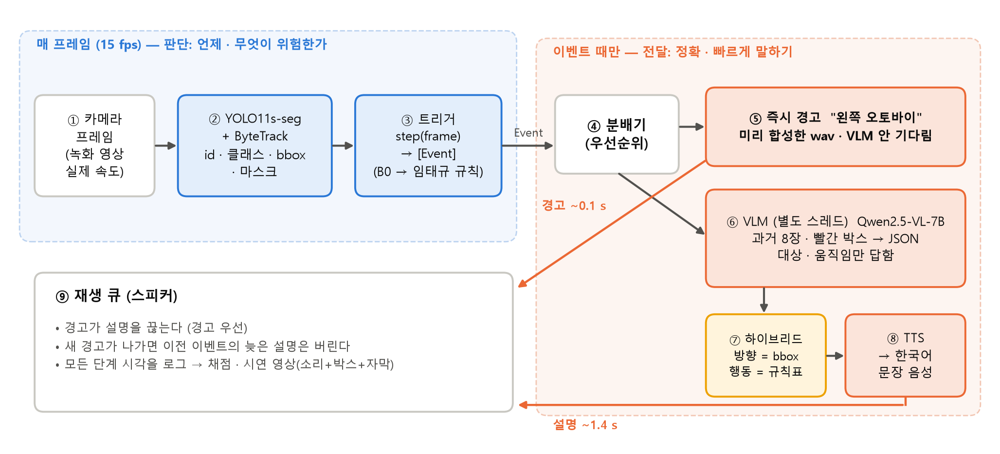
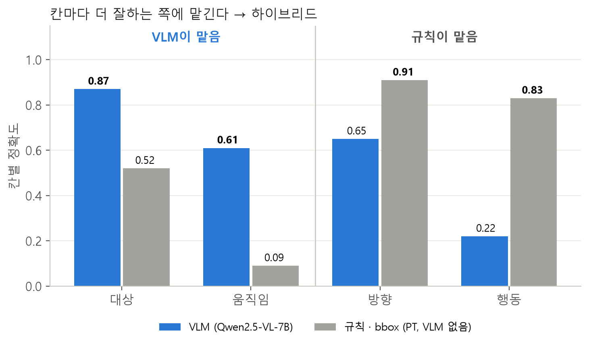
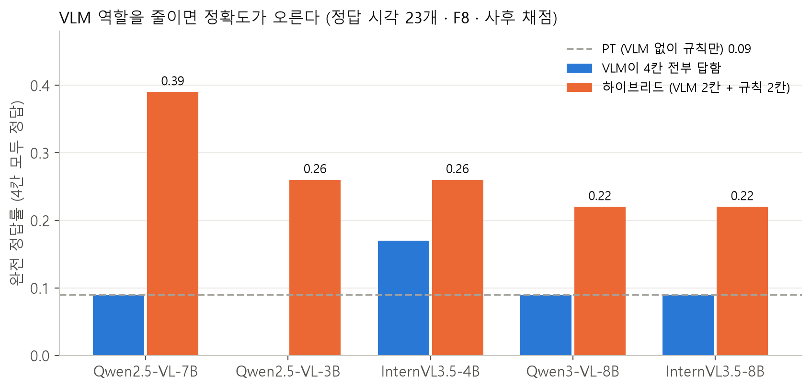
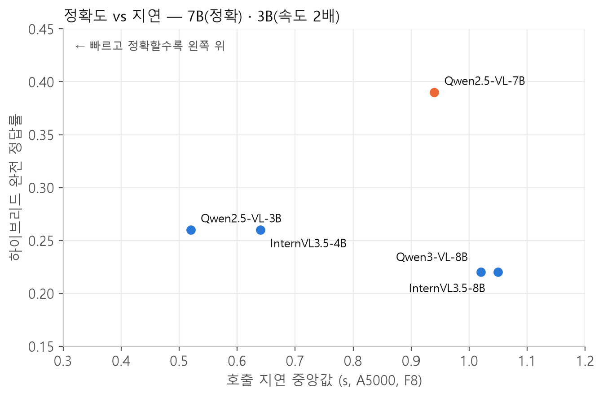
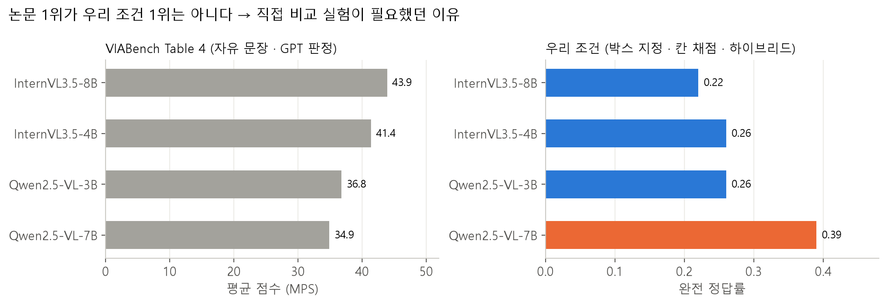
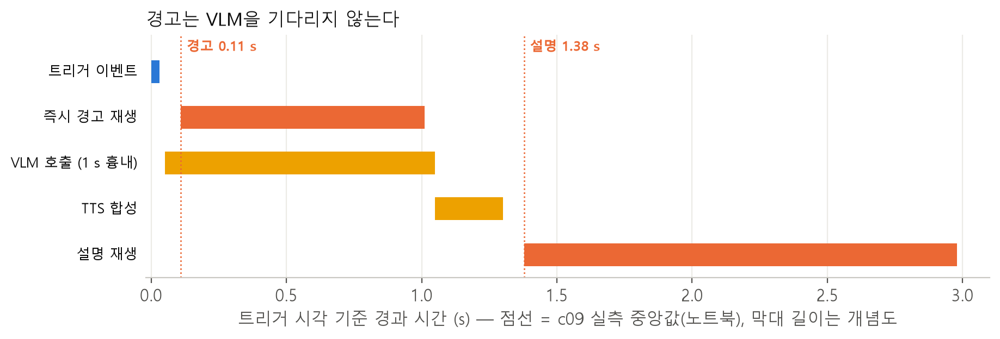
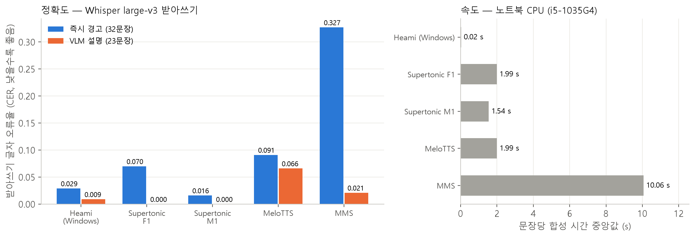
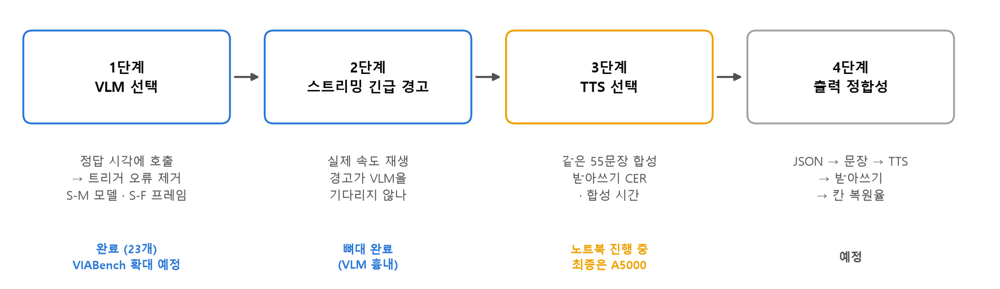

# A Proactive Egocentric Streaming Video Assistant for Blind Navigation

시각장애인 보행 보조를 위한 **능동형 1인칭 스트리밍 영상 어시스턴트** — Team Insight 캡스톤 프로젝트.

시각장애인이 몸에 단 카메라 영상을 매 프레임 가벼운 모듈(YOLO 인식 + 트리거 규칙)이 감시하다가, 위험한 순간에만 큰 모델(VLM)을 불러 상황을 설명하고 음성(TTS)으로 알린다.

## 브랜치

| 브랜치 | 담당 | 내용 |
|---|---|---|
| `main` | 공통 | 통합본 |
| `detection` | 박주영 | YOLO11s-seg 학습, 데이터셋 재라벨링, Foundation Model 인코더 비교 실험 |
| `taegyu` | 임태규 | 규칙 트리거 (언제 경고할지) |
| `SJ` | 박상준 | 트리거 → **VLM** → **TTS** 연결, 실행 시스템, VLM 호출 효율화 · 평가 |

---

## `SJ` 브랜치 진행 경과 (박상준)

주차는 매주 화요일 시작 기준 (`detection` 브랜치와 같음).

| 주차 | 기간 | 한 일 | 결과물 |
|---|---|---|---|
| [6주차](#6주차-2026-10-06--10-12-진행-중) | 2026-10-06 ~ 10-12 (진행 중) | VLM 5개 비교, 하이브리드 출력 설계, 실행 시스템(트리거 → 경고 · VLM → TTS → 재생) 완성, TTS 5개 비교 | [VLM 결과](docs/12_VLM비교실험_결과_평가계획.md) · [실행 시스템](code/runtime/README.md) · [TTS 비교](docs/15_TTS_비교실험.md) |
| [5주차](#5주차-2026-09-29--10-05) | 2026-09-29 ~ 10-05 | 평가 데이터(종설 10편) 정답 라벨, 1차 규칙 트리거 재현(B0), 거리 · 칼만 기반 기하 트리거(v2 · v3) 개발 후 폐기 | [기하 트리거 기록](docs/07_이전실험_기록_기하트리거.md) · [평가 라벨](docs/04_평가데이터_라벨.md) |

---

## 6주차 (2026-10-06 ~ 10-12, 진행 중)

> 작업 기록 원문: [`작업기록.md`](작업기록.md) · VLM 설계 근거: [`docs/11`](docs/11_P0_설계근거.md) · VLM 결과: [`docs/12`](docs/12_VLM비교실험_결과_평가계획.md) · 다음 단계: [`docs/13`](docs/13_다음단계_파이프라인.md) · TTS: [`docs/15`](docs/15_TTS_비교실험.md)

### TL;DR

| 질문 | 답 |
|---|---|
| 무엇을 만드나 | 트리거가 "위험"이라고 하면 **즉시 짧은 경고**("왼쪽 오토바이")를 내고, 동시에 **VLM이 "무엇이 · 어떻게"를 설명**해 음성으로 덧붙이는 시스템 |
| 핵심 설계 | **판단은 트래커 · 트리거, VLM은 "무엇이 · 어떻게"만** — 항목마다 더 정확한 쪽에 맡기는 하이브리드 (Fig. 3) |
| VLM | 잠정 **Qwen2.5-VL-7B** (정확도 1위) / 3B (속도 2배). ⚠️ 경고 23개로 낸 잠정 결과 → VIABench로 확대 예정 |
| 지금 끝까지 도나 | 예. 녹화 영상 1편(c09)을 실제 속도로 재생 → 경고 지연 중앙 **0.11 s**, 설명 지연 중앙 **1.38 s** (VLM은 1 s 지연 흉내) |
| TTS | 5개 엔진 비교 → **정확도 1위 Supertonic-3 M1** (55문장 중 54문장 정확). 설명용 엔진은 A5000에서 속도를 재고 결정 |

### 진행 기록

| 날짜 | 한 일 |
|---|---|
| 10/6 (화) | 수업 피드백 반영 (트리거 과도한 고도화 X, **다음 주 음성 필수**, 녹화 영상 시연 OK). 역할 재분배: 트리거 = 임태규, 박상준 = 트리거 → VLM → TTS 연결. A5000 서버 설치 · vLLM 오류 해결 |
| 10/6 밤 ~ 10/7 새벽 | **실험 A: VLM 5개 비교**. 하이브리드 사후 채점. VIABench 정답 자동 추출 (9,115개) |
| 10/7 (수) | **실험 B: 실행 시스템** 완성 · 시연 영상. **실험 C: TTS** 문장 55개 · 엔진 5개 합성. 5주차 기하 트리거 코드 복원 (임태규 참고용) |
| 10/8 (목) | **실험 C: TTS 받아쓰기 채점 완료** → 정확도 1위 Supertonic-3 M1. README · 그림 정리 |

---

### 0. 먼저 읽기 — 용어와 평가 데이터

#### 0-1. 용어

| 용어 | 뜻 |
|---|---|
| **VLM** | Vision-Language Model. 이미지(여러 장)와 글을 함께 받아 글로 답하는 모델 (예: Qwen2.5-VL). 이 프로젝트에선 "무엇이 어떻게 있는지" 설명을 맡음 |
| **TTS** | Text-to-Speech. 글을 소리로 바꾸는 음성 합성기 |
| **트리거** | 매 프레임 인식 결과를 보고 "지금 경고해야 하나"를 정하는 규칙. 경고해야 하면 **이벤트**를 하나 냄 |
| **B0** | 임태규의 1차 규칙 트리거를 우리 코드로 재현한 것. 물체 상자가 화면에서 제자리인 채 1.1배 이상 커지는 상태가 약 0.2 s 이어지면 "접근" 경고, 신호등 색(HSV 색 판정)이 바뀌면 신호 경고 |
| **E0** | `detection` 브랜치에서 학습한 YOLO11s-seg 가중치 (10개 클래스: 사람 · 자전거 · 킥보드 · 오토바이 · 자동차 · 버스 · 기타 차량 · 장애물 · 계단 · 신호등) |
| **bbox** | 인식기가 낸 물체 둘레 사각형 (bounding box) |
| **즉시 경고** | 이벤트가 나면 바로 재생하는 짧은 문장. "방향 + 물체" 꼴 (예: "왼쪽 오토바이") 또는 신호 2개 ("초록불로 바뀜", "빨간불로 바뀜"). 미리 소리 파일로 만들어 둠 |
| **설명** | 즉시 경고 뒤에 덧붙이는 VLM 기반 문장 (예: "정면에 자전거가 다가오고 있어요. 멈추세요.") |
| **시나리오 S1–S4** | 5주차에 팀이 정한 경고 종류. **S1** 다가오는 이동체(사람 · 자전거 · 차 등) · **S2** 경로 위 정지 장애물(가로수 · 노점 · 주차 자전거 등) · **S3** 보행 신호 변화 · **S4** 계단 · 턱 |
| **4칸** | 경고 하나를 나타내는 네 항목. **대상**(무엇이: 자전거 · 노점 …) · **방향**(왼쪽 / 정면 / 오른쪽) · **움직임**(다가옴 · 멈춰 있음 · 멀어짐 · 지나감 / 신호는 빨강 · 초록 · 초록으로 바뀜 · 빨강으로 바뀜 / 계단은 올라감 · 내려감) · **행동**(멈추세요 · 왼쪽으로 피하세요 · 오른쪽으로 피하세요 · 기다리세요 · 건너가세요 · 조심해서 가세요) |
| **규칙표** | 시나리오 × 방향 × 움직임 → 허용되는 행동 목록. 예: S2 정지 장애물이 왼쪽 → "오른쪽으로 피하세요" 또는 "조심해서 가세요" (`code/p0/ko_template.py`의 `action_ok`) |
| **정답 시각 호출 (oracle)** | 트리거 대신 **라벨에 적힌 정답 경고 시작 시각**에 VLM을 부르는 실험 방식. 트리거가 틀려서 생기는 오류를 빼고 VLM만 비교할 수 있음 |
| **PT** | VLM 없이 같은 4칸을 채우는 기준선. 대상 = YOLO 클래스, 방향 = bbox 위치, 움직임 = 시나리오별 고정값(S1은 다가옴 등), 행동 = 규칙표. "VLM이 실제로 더해주는 것"을 재기 위해 둠 |
| **하이브리드** | 대상 · 움직임은 VLM 답을 쓰고, 방향은 bbox 위치(화면 왼쪽 1/3 · 가운데 · 오른쪽 1/3, bbox가 없으면 VLM 답), 행동은 규칙표로 정하는 방식 |
| **F8** | VLM 입력 = 호출 시각까지 **과거 8장, 1초 간격** (= 최근 8초) |
| **A5000** | 실험에 쓴 대여 GPU 서버 (NVIDIA RTX A5000, 24 GB) |
| **vLLM** | VLM을 서버로 띄워 빠르게 답하게 하는 공개 추론 엔진 |
| **VIABench** | 시각장애인이 직접 찍은 보행 영상 530편 + 사람이 단 "언제 무엇을 말해야 하는지" 정답 13,152개를 담은 공개 벤치마크 (arXiv 2607.14660) |
| **중앙값** | 값을 크기순으로 늘어놓았을 때 가운데 값. 튀는 값 하나에 흔들리지 않아 지연 시간 요약에 씀 |

#### 0-2. 평가 데이터 — 종설 10편 · 경고 정답 23개

모든 실험(A · B)은 같은 영상 10편으로 잰다. 팀이 시나리오별로 고른 영상인데, 확인해 보니 **VIABench 원본 영상**이었다 (파일 크기 완전 일치). 총 9.1분, 2편은 야간이다.

| ID | 장면 | 길이 | 경고 정답 (시나리오 · 움직임) |
|---|---|---|---|
| c01_vehicle_cross | 차량 횡단 | 41 s | S2 정지 장애물 4 |
| c02_step | 계단 · 에스컬레이터 | 138 s | S4 계단 2 (내려감 · 올라감) · S2 3 |
| c03_offpath_obst | 경로 밖 장애물 | 70 s | S4 계단 1 |
| c04_parked_cars | 길옆 주차 차량 | 38 s | 없음 (경고하면 안 되는 영상) |
| c05_path_obst_recede | 경로 장애물 + 멀어지는 차 | 25 s | S2 2 |
| c06_wait_signal | 신호 대기 | 58 s | S3 신호 3 (초록으로 2 · 빨강으로 1) |
| c07_light_rg | 신호 빨강 → 초록 | 47 s | S3 1 · S4 1 |
| c08_light_rgr_night | 신호 빨 → 초 → 빨 (야간) | 40 s | S3 1 · S4 1 |
| c09_bike_on_tactile | 점자블록 위 자전거 | 50 s | S2 3 |
| c10_front_obst_night | 정면 장애물 (야간) | 39 s | S2 1 |
| **합계** | | **546 s** | **23 = S2 13 · S3 5 · S4 5 · S1 0** |

**정답을 어떻게 만들었나**

1. **언제 (v2 라벨, 10/5):** VIABench 정답(사람이 안내한 시간 구간 + 영어 안내 문장)을 우리 시나리오 S1–S4로 다시 분류 (`code/labels_draft.py`). 정답마다 4프레임을 직접 보고 경고 대상이 아닌 4개를 뺐다. 구간 하나 = "이 사이에 경고가 나와야 함".
2. **무엇을 (v3 라벨, 10/6):** 경고 23개마다 4칸 정답을 달았다. 대상 · 움직임은 VIABench 영어 문장과 프레임으로, 방향은 대상 bbox 위치로, 행동은 규칙표로 정했다 (`labels/v3/*.json`의 `target_ok` · `direction` · `motion` · `action_ok`). 대상은 동의어도 정답으로 인정 (예: 주차 스쿠터 → 킥보드 · 오토바이도 정답).

> ⚠️ **알고 읽어야 할 점.** ① 23개 모두 **움직이는 물체(S1)가 0개**다. ② v3의 4칸은 Claude가 초안을 만든 것(`annotator: claude-draft`)이고 **팀원 교차 검수 전**이다. ③ 23개는 통계적으로 작다 (정답률 70 % 근처에서 95 % 신뢰구간이 약 ±19 %p). 그래서 모든 결론은 "잠정"이며, VIABench 정답과 팀 촬영 영상으로 확대할 예정이다.

---

### 1. 시스템 구조



**Fig. 1.** 왼쪽(파랑)은 매 프레임 도는 **판단** 경로, 오른쪽(주황)은 이벤트가 생길 때만 도는 **전달** 경로다. 경고는 미리 만든 소리라 VLM을 기다리지 않는다.

| 모듈 | 쓰는 것 | 왜 이걸 쓰나 |
|---|---|---|
| ② 인식 · 추적 | YOLO11s-seg (E0) + **ByteTrack** | 매 프레임 돌아야 하므로 가벼운 1단 검출기. ByteTrack(ECCV'22)은 점수가 낮은 박스까지 이어 붙여 가려져도 물체 번호(ID)가 잘 유지됨 → 트리거가 "같은 물체가 커지는지"를 볼 수 있음 |
| ③ 트리거 | `step(frame) → [Event]` 인터페이스, 현재 B0 | 트리거는 임태규 담당 → **입출력 형식만 고정**하고 최종 규칙 코드가 오면 교체 |
| ④ 분배기 | 이벤트 → 경고 / VLM 두 갈래 | 위급할 때 VLM 지연(~1 s)이 경고를 막으면 안 됨 |
| ⑤ 즉시 경고 | 32개 문장을 **미리 합성한 소리 파일** | 합성 시간 0 → 경고 지연 ≈ 트리거 지연. VIABench는 7B 응답만 4.6 s(32프레임)라 VLM 뒤에 경고를 두면 늦음 |
| ⑥ VLM | Qwen2.5-VL-7B, vLLM 서버, 별도 스레드 | 아래 실험 A로 선정 |
| ⑦ 하이브리드 | 대상 · 움직임 = VLM / 방향 = bbox / 행동 = 규칙표 | 실험 A의 Fig. 3: 항목마다 더 정확한 쪽에 맡김 |
| ⑨ 재생 큐 | 경고 우선 · 늦은 설명 버림 | 지나간 물체 설명이 새 경고 뒤에 나오면 오히려 혼란 |

---

### 2. 실험 A — VLM 비교: 어느 모델이 경고 상황을 가장 정확 · 빠르게 설명하나

| 항목 | 내용 |
|---|---|
| 질문 | 트리거가 경고할 때 어느 VLM이 대상을 가장 정확 · 빠르게 설명하나 |
| 데이터 | 0-2절의 **경고 정답 23개** (종설 10편) |
| 호출 시각 | 정답 시각 (oracle) — 각 정답 구간의 시작 시각 |
| 입력 | 호출 시각까지 과거 8장 · 1초 간격 (F8), 긴 변 448 px, 대상 물체에 **빨간 박스**를 그려서 줌 |
| 출력 | JSON 형식 강제: 대상 · 방향 · 움직임 · 행동 · 위험 여부 → 템플릿으로 한국어 문장 |
| 반복 | 같은 입력 3회 (temperature 0이라 답은 같음, 지연만 3번 재서 중앙값) |
| 장비 | A5000, vLLM 0.31.0, bf16 |

#### 2-1. 왜 직접 비교했나 — 논문 표만으로는 고를 수 없었다

우리 조건과 가장 가까운 공개 결과는 **VIABench Table 4** (정답 시각 직전 32프레임 → 안내 문장 생성, GPT-5가 정답 문장과 비교해 0–100점 = MPS)다. 그런데 정확도와 속도가 반대 방향이다.

| 근거 (원문 확인) | InternVL3.5-8B | Qwen2.5-VL-7B |
|---|---|---|
| VIABench Table 4 평균 (MPS ↑) | **43.9** (1위) | 34.9 |
| VIABench Table 4 장애물 경고 항목 (MPS ↑) | **40.8** | 37.8 |
| VIABench §8.3 응답 시간 (32프레임, L20 GPU, ↓) | 15.5 s | **4.6 s** |
| EgoBlind (NeurIPS'25) 전체 정답률 (↑) | (이전 세대 InternVL2.5-8B 53.5) | 45.5 |

→ 설명은 위험 구간이 끝나기 전에 들려야 의미가 있다. **15 s 걸리는 1위 모델은 우리 시스템에서 쓸 수 없다.** 그래서 논문에서 후보만 뽑고, 우리 데이터 · 우리 출력 형식으로 직접 비교했다.

#### 2-2. 후보 5개와 각 모델의 특징

| 후보 | 크기 | 구조적 특징 | 넣은 이유 |
|---|---|---|---|
| **Qwen2.5-VL-7B** | 7B | 원본 해상도를 그대로 받는 이미지 인코더 + 프레임 사이 시간 간격을 위치 정보(MRoPE)에 반영 | VIABench에서 빠름(4.6 s), 장애물 · 신호 항목 상위권. 효율화 연구 후보들(P1–P3)의 공식 코드가 이 모델 기준 |
| Qwen2.5-VL-3B | 3B | 7B와 같은 구조, 언어 모델만 작음 | VIABench 평균이 7B보다 높음(36.8). 기기 탑재(8–11주차) 후보 |
| InternVL3.5-8B | 8B | 이미지 인코더 → 연결층 → 언어 모델, 448 px 정사각형 조각(타일) 단위 입력 | VIABench 평균 · 장애물 1위 |
| InternVL3.5-4B | 4B | 위와 같은 구조 | VIABench 평균 2위, 8B의 절반 크기 |
| Qwen3-VL-8B | 8B | Qwen2.5-VL 후속 (2025-10), 여러 층의 이미지 특징을 언어 모델에 넣음, 프레임 시각을 글로 표시 | 최신인데 VIABench · EgoBlind에 결과가 없음 → **근거가 없어서 직접 잼** |
| ~~Kimi-VL-A3B~~ | 16B | 전문가 혼합(MoE) | 메모리 ~32 GB → A5000(24 GB)에 안 올라감, vLLM에서 영상 입력 미지원 → 제외 |

#### 2-3. 실험 설계 — 각 선택의 이유

| 설계 | 선택 | 이유 · 근거 |
|---|---|---|
| 언제 호출하나 | **정답 시각** | 트리거 오류를 빼고 **VLM 성능만** 비교. VIABench Table 4와 같은 방식 |
| 무엇을 답하나 | 자유 문장 대신 **JSON 4칸** | 항목마다 정답/오답이 기계적으로 정해짐 → 사람 · GPT 판정 없이 스크립트로 채점. vLLM 구조화 출력으로 형식 오류 0 |
| 왜 GPT 판정을 안 쓰나 | 4칸 규칙 채점 | VIABLE (EMNLP'26): 가장 좋은 판정 모델도 오류 진단 정확도 52.6 %, 자기 모델 답을 더 좋게 보는 편향 94.2 % |
| 대상을 어떻게 알려주나 | 트래커 bbox를 각 프레임에 **빨간 박스로 그림** | 시각 프롬프트 (ViP-LLaVA, CVPR'24). 화면에 물체가 여럿일 때 어느 것을 설명할지 헷갈리지 않게 |
| 프레임 몇 장 | **F8 (과거 8장 · 1초 간격)** | VIABench Table 5: 8 → 128장으로 늘려도 이득이 미미하고, 다수 모델이 8장에서 최고점. 1 · 3 · 32장은 다음 실험(S-F)에서 비교 예정 |
| 프레임 넣는 방식 | 동영상 입력 대신 **이미지 여러 장** + 각 장의 시각을 글로 표시 | 모델마다 동영상 압축 방식이 달라 같은 프레임이어도 정보량이 달라짐 → 공정 비교 |
| 해상도 | 프레임당 시각 토큰 **~256개로 맞춤** | InternVL3.5 공식 카드: 타일 1개 = 256 토큰. 모델 간 입력량 맞춤 |
| 기준선 | **PT** (VLM 없음) | VLM이 실제로 더해주는 것을 빼서 보기 위함 |

#### 2-4. 지표 — 무엇을 어떻게 쟀나

| 지표 | 계산 | 좋은 방향 |
|---|---|---|
| **항목별 정확도** (대상 · 방향 · 움직임 · 행동) | 23개 중 그 항목이 맞은 비율. 대상은 동의어 목록(`target_ok`) 안이면 정답, 행동은 규칙표의 허용 목록(`action_ok`) 안이면 정답 | **높을수록 ↑** (1 = 전부 맞음) |
| **완전 정답률** | 23개 중 **4항목이 모두 맞은** 비율 = 사용자가 틀린 정보를 하나도 안 듣는 경우 | **높을수록 ↑** |
| **지연** | VLM에 요청을 보내고 JSON 답을 다 받을 때까지 걸린 시간, 23개 × 3회의 중앙값 | **낮을수록 ↓** |
| McNemar p | 같은 23개 경고에서 두 모델의 정답/오답을 짝지어 비교하는 통계 검정. p < 0.05면 "차이가 우연이 아니다" | 작을수록 차이가 확실 |

#### 2-5. 결과

**(1) VLM이 4항목을 다 답하게 하면, VLM 없는 기준선과 차이가 없다.**

| 모델 (4항목 전부 VLM) | 완전 정답 ↑ | 대상 ↑ | 방향 ↑ | 움직임 ↑ | 행동 ↑ | 지연 ↓ |
|---|---|---|---|---|---|---|
| Qwen2.5-VL-7B | 0.09 | **0.87** | 0.65 | **0.61** | 0.22 | 0.94 s |
| Qwen2.5-VL-3B | 0.00 | 0.61 | 0.52 | 0.48 | 0.39 | **0.52 s** |
| InternVL3.5-4B | **0.17** | 0.74 | 0.43 | 0.39 | 0.26 | 0.64 s |
| Qwen3-VL-8B | 0.09 | 0.83 | 0.57 | 0.48 | 0.43 | 1.02 s |
| InternVL3.5-8B | 0.09 | 0.70 | 0.43 | 0.52 | 0.43 | 1.05 s |
| PT (VLM 없음) | 0.09 | 0.52 | **0.91** | 0.09 | **0.83** | 0 s |

완전 정답 차이는 통계적으로 유의하지 않다 (7B 대비 McNemar p = 1.0). 지연 차이만 유의하다 (p < 0.001).



**Fig. 3.** 위 표에서 7B와 PT만 뽑은 것. VLM은 **대상(0.52 → 0.87)과 움직임(0.09 → 0.61)** 에서 크게 낫고, **방향 · 행동은 규칙이 낫다** (VLM은 정면 박스를 "왼쪽"이라 하거나, 모델마다 "조심하세요" 같은 버릇 같은 행동을 말함). → **항목마다 더 잘하는 쪽에 맡기는 하이브리드**로 설계를 바꿨다.

**(2) 하이브리드로 다시 채점하면 모든 모델의 완전 정답률이 오른다.**

같은 VLM 답을 GPU 없이 다시 채점만 했다 (`code/p0/hybrid_eval.py`). 방향은 bbox가 있으면 bbox, 없으면 VLM 답을 쓰므로 모델마다 조금 다르다. 행동은 VLM이 답한 움직임으로 규칙표를 찾으므로 역시 모델마다 다르다.



**Fig. 2.** 파랑 = VLM이 4항목 전부 답함, 주황 = 하이브리드. Qwen2.5-VL-7B **0.09 → 0.39**.

| 순위 | 모델 (하이브리드) | 완전 정답 ↑ | 대상 ↑ | 방향 ↑ | 움직임 ↑ | 행동 ↑ | 지연 ↓ |
|---|---|---|---|---|---|---|---|
| 1 | **Qwen2.5-VL-7B** | **0.39** | 0.87 | 0.83 | 0.61 | 0.78 | 0.94 s |
| 2 | Qwen2.5-VL-3B | 0.26 | 0.61 | 0.74 | 0.48 | 0.87 | **0.52 s** |
| 2 | InternVL3.5-4B | 0.26 | 0.74 | 0.57 | 0.39 | 0.91 | 0.64 s |
| 4 | Qwen3-VL-8B | 0.22 | 0.83 | 0.65 | 0.48 | 0.78 | 1.02 s |
| 4 | InternVL3.5-8B | 0.22 | 0.70 | 0.61 | 0.52 | 0.78 | 1.05 s |
| — | PT (VLM 없음) | 0.09 | 0.52 | 0.91 | 0.09 | 0.83 | 0 s |

0.39 = 23개 중 9개, 0.26 = 6개, 0.22 = 5개, 0.09 = 2개. 하이브리드 결과에는 아직 유의성 검정을 하지 않았다.

<p align="center"></p>

**Fig. 4.** 가로 = 지연(낮을수록 좋음), 세로 = 하이브리드 완전 정답률(높을수록 좋음). 왼쪽 위일수록 좋다. 7B가 가장 정확하고, 3B가 가장 빠르다.

**(3) 논문 순위와 우리 순위가 다르다 → 직접 비교가 필요했던 이유.**



**Fig. 5.** 왼쪽 = VIABench 논문 점수(자유 문장 · GPT 판정), 오른쪽 = 우리 조건(빨간 박스로 대상 지정 · 4항목 채점 · 하이브리드). 논문 1위 InternVL3.5-8B가 우리 조건에서는 최하위다. InternVL은 정사각형 타일이라 입력 토큰이 1.6배(2,468 vs 1,564)인데도 낮았고, 박스 친 물체를 잘못 말하는 경우가 많았다 (노점 → 차량, 표지판 → 사람).

| 5개 모델 공통 약점 | 내용 |
|---|---|
| 시간 변화 | **신호등이 초록으로 바뀐 장면 4개를 5개 모델 모두 "빨간불" 또는 "정지"로 답함** |
| 계단 위/아래 | 대부분 "정지" 또는 반대 방향 |

> ⚠️ **한계 — 아직 "잠정"인 이유.** 경고 23개 · 움직이는 물체 0개 · 4칸 정답은 검수 전 초안 · 하이브리드는 결과를 보고 설계한 **사후 분석**이다. → **VIABench 정답(13,152개 중 장애물 경고 6,776개)과 팀 촬영 영상으로 다시 확인해야 주장 가능.** VIABench 영어 정답 문장에서 대상 · 움직임을 규칙으로 자동 추출해 두었다 (`code/viabench_extract.py`: 9,115개 중 대상 96 % 추출, 대상 + 움직임 둘 다 5,033개).

---

### 3. 실험 B — 실행 시스템: 실제 속도로 돌렸을 때 경고가 늦지 않나

| 항목 | 내용 |
|---|---|
| 질문 | 녹화 영상을 실제 속도로 재생하며 전체 시스템을 돌렸을 때 경고와 설명이 얼마나 빨리 나오나 |
| 데이터 | **c09_bike_on_tactile 1편** (50 s, 점자블록 위 자전거) |
| 설정 | 노트북 · 미리 저장한 E0 인식 결과 · 트리거 B0 · **VLM은 진짜가 아니라 1 s 기다린 뒤 PT 답을 내는 흉내** · TTS = Windows 기본 한국어 음성(Heami) |
| 결과 수 | 트리거 이벤트 7개 → 경고 6개 재생 (1개는 같은 물체 중복이라 생략) · 설명 6개 생성 → 4개 재생, 2개는 새 경고에 끊김 |

| 지표 | 계산 | 결과 | 좋은 방향 |
|---|---|---|---|
| **경고 지연** | 경고 소리가 시작된 시각 − 트리거 이벤트 시각 | 중앙 **0.11 s** (최대 0.22 s, n = 6) | **낮을수록 ↓** |
| **설명 지연** | 설명 소리가 시작된 시각 − 트리거 이벤트 시각 (VLM 1 s + TTS 합성 + 경고가 끝나기를 기다린 시간 포함) | 중앙 **1.38 s** (최대 1.50 s, n = 6) | **낮을수록 ↓** |
| 프레임 지연 | 영상이 화면에 나와야 할 시각과 실제 처리된 시각의 차이 | 중앙 0.05 s | **낮을수록 ↓** |



**Fig. 6.** 점선 두 개(경고 0.11 s, 설명 1.38 s)만 실측 중앙값이고, 막대 길이는 순서를 보여주는 개념도다. 실제 VLM이 아니라 흉내값이므로 A5000에서 다시 잰다.

| 함께 확인한 것 | 결과 |
|---|---|
| 스트리밍 B0 = 미리 계산한 B0 | 10편 모두 경고 시각 · 시나리오 · 물체 번호가 **같음** (`test_b0_stream.py`) → 실시간으로 돌려도 트리거 결과가 바뀌지 않음 |
| TTS 소리 앞뒤 무음 제거 | 설명 지연 중앙 1.99 → **1.38 s** |
| 새 경고가 나가면 이전 이벤트 설명 버림 | 지난 물체 설명이 새 경고 뒤에 나가던 문제 해결 |
| 4K 영상 (c05) | 영상 풀기만으로 실시간 불가 (10 s 분량에 25.8 s) → 미리 변환한 재생용 영상으로 해결 |
| **발견** | 영상을 h264로 다시 압축하기만 해도 B0 경고가 **10편 중 3편에서 바뀜** → 규칙 트리거의 문턱이 매우 민감 (임태규에게 전달) |

```bash
cd code/runtime
python run_demo.py --clip c09_bike_on_tactile --vlm mock --mock-latency 1.0 --render   # → 시연 영상 demo.mp4
```

---

### 4. 실험 C — TTS 비교: 어느 한국어 음성 합성기가 빠르고 정확하게 들리나

| 항목 | 내용 |
|---|---|
| 질문 | 어느 한국어 TTS가 빠르고 알아듣기 쉬운가 |
| 결정 기준 | 받아쓰기 오류율이 낮은 엔진 중 합성이 가장 빠른 것 (안전 정보 → 정확도 먼저) |
| 장비 | 노트북 CPU (Intel i5-1035G4, 노트북 GPU MX250은 2 GB라 사용 불가). **비교 방법 검증 단계**이고, 최종 수치는 A5000에서 같은 스크립트로 다시 냄 |

#### 4-1. 평가 문장 55개는 어디서 왔나

TTS가 **실제 시스템에서 읽게 될 문장만** 평가하려고, 실행 시스템과 **같은 코드**로 만들었다 (`code/tts_bench/sentences.py` → `results/tts_bench/sentences.json`). 영상에서 뽑은 문장이 아니라, 시스템이 낼 수 있는 문장 목록이다.

| 묶음 | 개수 | 만드는 법 | 예 |
|---|---|---|---|
| **경고 문장 (W)** | **32** | 즉시 경고 문장 **전부**. E0의 10개 클래스 × 방향 3개(왼쪽 · 정면 · 오른쪽) = 30개 + 신호 변화 2개("초록불로 바뀜", "빨간불로 바뀜") | "왼쪽 오토바이", "정면 계단", "오른쪽 장애물" |
| **설명 문장 (D)** | **23** | VLM 답(4칸) → 한국어 문장 템플릿(`ko_template.sentence`)으로 만든 문장을 시나리오마다 고르게 뽑음: S1 대상 7종(사람 · 자전거 · 킥보드 · 오토바이 · 자동차 · 버스 · 기타 차량)마다 움직임 1개(다가옴 · 지나감 · 멀어짐 돌아가며) + S2 장애물 10종(나무 · 기둥 · 볼라드 · 표지판 · 노점 · 세워진 자전거 · 세워진 킥보드 · 벤치 · 펜스 · 장애물) + S3 신호 4종(빨강 · 초록 · 초록으로 바뀜 · 빨강으로 바뀜) + S4 계단 2종(올라감 · 내려감). 방향은 무작위(seed 0), 행동은 규칙표 | "정면에 자전거가 다가오고 있어요. 멈추세요." / "오른쪽 신호등이 빨간불이에요. 기다리세요." |

설명 문장 23개는 실험 A의 경고 정답 23개와 **숫자만 같고 서로 관계없다**.

#### 4-2. 후보 엔진

| 엔진 | 특징 | 실행 |
|---|---|---|
| Windows Heami | Windows 내장 한국어 음성 (설치 없이 쓰는 기준선) | 노트북 CPU |
| **Supertonic-3** F1(여) · M1(남) | ~99M 파라미터, ONNX, 31개 언어 (arXiv 2503.23108) | CPU (기기 탑재 후보) |
| MeloTTS-Korean | VITS 계열, MIT 라이선스 | CPU/GPU |
| MMS-TTS-kor | Meta MMS (JMLR'24), VITS, 한국어를 로마자로 바꿔 입력 | CPU/GPU |
| CosyVoice2 · Fun-CosyVoice3 (0.5B) | 언어 모델 + flow matching, 스트리밍 첫 소리 ~150 ms (arXiv 2412.10117 · 2505.17589) | A5000 (예정) |
| Chatterbox Multilingual | 0.5B, 23개 언어 | A5000 (예정) |

#### 4-3. 지표 — 무엇을 어떻게 쟀나

| 지표 | 뜻 | 계산 | 좋은 방향 |
|---|---|---|---|
| **경고 CER** | 경고 문장 32개가 얼마나 틀리게 들리나 | TTS 소리를 음성 인식 모델 Whisper large-v3로 받아 적고 원문과 비교. 공백 · 문장부호를 빼고 **틀린 글자 수(빠짐 · 더해짐 · 바뀜) ÷ 원문 글자 수** → 문장마다 구해 32개 평균. 0.016 = 100글자 중 약 1.6글자 틀림 | **낮을수록 ↓** (0 = 완벽) |
| **설명 CER** | 설명 문장 23개의 오류율 | 위와 같은 방식, 23개 평균 | **낮을수록 ↓** |
| **문장 정확** | 한 글자도 안 틀리고 받아 적힌 문장 수 | 공백 · 문장부호를 뺀 받아쓰기 = 원문이면 정확. 55개 중 개수 | **높을수록 ↑** (55 만점) |
| **합성 시간** | 문장 하나를 소리 파일로 만드는 데 걸린 시간 | 글자 입력 → 소리 파일 완성까지 걸린 시간, 55문장의 중앙값. 모델 불러오기 · 예열은 제외. 노트북 CPU 기준 | **낮을수록 ↓** (설명 지연에 그대로 더해짐) |

CER이 높으면 TTS가 잘못 발음했거나, 받아쓰기 모델이 잘못 들은 것이다. 둘을 구분하려면 직접 들어야 한다.

#### 4-4. 결과 (노트북, 10/8)



**Fig. 8.** 왼쪽 = 받아쓰기 글자 오류율 (낮을수록 잘 들림), 오른쪽 = 문장당 합성 시간 (낮을수록 빠름, 노트북 CPU).

| 엔진 | 경고 CER ↓ (32문장) | 설명 CER ↓ (23문장) | 문장 정확 ↑ (/55) | 합성 시간 ↓ | 대표 오류 (원문 → 받아쓰기) |
|---|---|---|---|---|---|
| Windows Heami | 0.029 | 0.009 | 50 | **0.02 s** | 장애물 → "창의 물", **빨간불 → "밝은 불"** |
| Supertonic-3 F1 (여) | 0.070 | **0.000** | 50 | 1.99 s | 짧은 경고 끝이 잘림 ("정면 계단" → "정면") |
| **Supertonic-3 M1 (남)** | **0.016** | **0.000** | **54** | 1.55 s | "정면 계단" → "정면" 1건뿐 |
| MeloTTS-Korean | 0.091 | 0.066 | 42 | 1.99 s | "정면" → "정년" 반복, 설명 앞부분 통째 빠짐 |
| MMS-TTS-kor | 0.327 | 0.021 | 29 | 10.06 s | 경고 대부분 깨짐 ("빨간불로 바뀜" → "빨란 블루팟 게임") |

- **정확도는 Supertonic-3 M1이 가장 좋다** (55문장 중 54문장 정확). 신호 색처럼 안전에 직결되는 단어도 틀리지 않았다.
- **즉시 경고**는 미리 만들어 두므로 합성 속도와 무관 → **M1으로 미리 합성**하는 것이 유력.
- **설명**은 합성 시간이 설명 지연에 그대로 더해진다. Heami는 0.02 s지만 "빨간불" 오류, M1은 노트북에서 1.5 s → **A5000에서 다시 재고 결정** (CosyVoice 스트리밍 첫 소리와도 비교).
- MeloTTS · MMS는 정확도 때문에 탈락 후보.
- ⚠️ 문장 55개 · 받아쓰기 모델 1개라 0.01–0.02 차이는 의미 없음. 짧은 경고는 받아쓰기 모델이 놓쳤을 수 있어 **틀린 문장은 직접 들어 확인 예정**.

---

### 5. 평가 계획 — 4단계



**Fig. 7.** YOLO + 트리거가 **판단**(언제 · 무엇이), VLM + TTS가 **전달**(정확 · 빠르게)을 맡으므로, 전달 쪽을 단계별로 떼어서 잰다. 1단계 = 실험 A, 2단계 = 실험 B, 3단계 = 실험 C.

| 단계 | 질문 | 왜 이렇게 나눴나 | 지표 | 상태 |
|---|---|---|---|---|
| 1. VLM 선택 | 어느 VLM이 대상을 가장 정확 · 빠르게 설명하나 | 정답 시각 호출로 트리거 오류를 제거 → VLM만의 성능 | 완전 정답 · 항목별 정확도 · 지연 | 23개로 잠정 → VIABench 확대 |
| 2. 스트리밍 긴급 경고 | 위급할 때 경고가 VLM을 기다리지 않고 바로 나오나 | 실제 서비스는 스트리밍 → 대기열 · 우선순위 문제는 이 단계에서만 보임 | 경고 지연 · 설명 지연 · VLM 호출 수 | 뼈대 완료 (VLM 흉내) |
| 3. TTS 선택 | 어느 한국어 TTS가 빠르고 알아듣기 쉬운가 | GPU 없이 먼저 가능, 다음 주 음성 시연 필수 | CER · 문장 정확 · 합성 시간 | 노트북 완료 → A5000 |
| 4. 출력 정합성 | VLM이 말하려던 내용이 소리로 정확히 전달되나 | VLM이 맞아도 TTS가 "빨간불"을 "밝은 불"로 읽으면 실패 | 4칸 → 문장 → TTS → 받아쓰기 → 4칸을 되살린 비율 | 예정 |

---

### 6. 다음 할 일

| 순서 | 할 일 |
|---|---|
| 1 | TTS 틀린 문장 직접 듣기 → A5000에서 GPU 후보 포함 최종 비교 · 엔진 확정 |
| 2 | 하이브리드를 VLM 호출 코드에 정식 구현 (VLM은 대상 · 움직임 · 위험 여부만 답함) |
| 3 | **평가 데이터 확대**: VIABench 정답 시각 평가 (7B · 3B), 팀 촬영 영상(움직이는 물체) 라벨, 4칸 정답 팀원 검수 |
| 4 | 실시간 실험: 실행 시스템 전체를 A5000에서 (YOLO + VLM + TTS 한 GPU), 진짜 VLM으로 경고 · 설명 지연 측정 |
| 5 | 임태규 최종 트리거가 오면 인터페이스에 끼워 재실행 |

### 부록 A: 폴더 구조

```
├─ README.md                 이 파일
├─ 작업기록.md               날짜별 작업 기록
├─ assets/                   README 그림 (code/readme_figs/로 다시 그림)
├─ docs/                     설계 · 결과 문서 04–15 (아래 부록 B)
├─ labels/                   평가 정답 (종설 10편)
│  ├─ v2/                    경고 구간 정답 (트리거 채점용)
│  └─ v3/                    v2 + 4칸 정답 (VLM 채점용)
├─ code/
│  ├─ common.py              영상 10편 목록 · 경로 · 프레임 읽기 · 클래스 목록
│  ├─ dump_tracks.py         YOLO 인식 + 추적 결과 저장
│  ├─ motion.py              배경 움직임 (B0 입력)
│  ├─ baseline_rule.py       B0 = 1차 규칙 트리거
│  ├─ evaluate.py            트리거 채점 (PDR · 정밀도 · 오탐/분)
│  ├─ labels_draft.py        VIABench 정답 → 라벨 v2
│  ├─ labels_v3.py           v2 + 판단 → 라벨 v3 (4칸)
│  ├─ viabench_extract.py    VIABench 정답 문장 → 대상 · 움직임 자동 추출
│  ├─ insight_fm/            A5 가중치를 불러올 때 필요한 모듈
│  ├─ p0/                    실험 A: VLM 호출 · 비교 (vLLM 서버, 프레임, JSON 형식, 한국어 템플릿 · 규칙표, 채점, 하이브리드 채점)
│  ├─ runtime/               실험 B: 실행 시스템 (트리거 인터페이스 · 분배기 · VLM 작업자 · TTS · 재생 큐 · 시연 영상)
│  ├─ tts_bench/             실험 C: TTS 비교 (문장 세트 · 합성 · 받아쓰기 채점 · A5000 스크립트)
│  └─ readme_figs/           README 그림 생성 코드
└─ v3_기하트리거/            5주차 기하 트리거 코드 + 설명 (임태규 참고용)
```

GitHub에 올리지 않는 것 (용량 · 저작권 · 개인 작업물): `results/` (실험 결과 · 시연 영상), `benchmarks/` (VIABench · OVO-Bench 주석), `labels/evidence/` (VIABench 프레임 이미지), 인식 가중치(`best_E0.pt` 등), `발표자료/`, `docs/01–03` (초기 계획 문서). 평가 영상 원본은 VIABench에서 받는다.

### 부록 B: 문서

| 문서 | 내용 |
|---|---|
| `04_평가데이터_라벨.md` | 종설 10편 = VIABench, 정답 재분류 규칙, 라벨 프레임 확인 |
| `05_트리거_비교실험_설계.md` | 트리거 · VLM 호출 · 전체 시스템 비교 실험 초기 설계 (08–12로 구체화) |
| `06_데이터셋_라벨_조사.md` | 공개 데이터셋 · 라벨 조사 |
| `07_이전실험_기록_기하트리거.md` | 5주차 기하 트리거 (폐기된 실험 기록) |
| `08_스트리밍_VLM_호출_효율화.md` | VLM 호출 효율화 비교군 P0–P5 |
| `09_평가데이터_지표_실험설계.md` | 4칸 라벨 · 지표 · 실험 설계 |
| `10_공개벤치마크_평가지표.md` | 공개 벤치마크 · 지표 선정 |
| `11_P0_설계근거.md` | 실험 A 모델 · 프레임 선택 근거 (논문 원문 표) |
| **`12_VLM비교실험_결과_평가계획.md`** | **실험 A 결과 · 4단계 평가 계획 · 서버 설치 순서** |
| **`13_다음단계_파이프라인.md`** | **실행 시스템 구조 · 단계별 실험 상세 · 일정** |
| `14_VLM평가데이터_최소라벨링.md` | VIABench 자동 추출 · 공개 데이터셋 조사 |
| **`15_TTS_비교실험.md`** | **실험 C 설계 · 결과** |

### 참고 문헌

| 약칭 | 출처 | 쓰인 곳 |
|---|---|---|
| VIABench | arXiv 2607.14660 (Table 4 · 5, §8.2 · 8.3) | 모델 후보 · 프레임 수 · 지연 · 평가 데이터 |
| EgoBlind | NeurIPS'25 D&B, arXiv 2503.08221 | 모델 후보 |
| WalkVLM | ICCV'25, arXiv 2412.20903 | 프레임 설정 후보 (3장 · 0.5초 간격) |
| VIABLE | EMNLP'26 | LLM 판정을 주 지표로 쓰지 않는 근거 |
| ViP-LLaVA | CVPR'24 | 빨간 박스 시각 프롬프트 |
| Qwen2.5-VL / Qwen3-VL / InternVL3.5 | 각 기술 보고서 · 모델 카드 | 모델 구조 · 입력 토큰 |
| ByteTrack | ECCV'22 | 추적기 |
| vLLM | SOSP'23 (PagedAttention) | VLM 서빙 |
| Whisper | Radford et al., ICML'23 | TTS 받아쓰기 채점 |

---

## 5주차 (2026-09-29 ~ 10-05)

> 기록: [`docs/07`](docs/07_이전실험_기록_기하트리거.md) (기하 트리거 · 폐기 이유) · [`docs/04`](docs/04_평가데이터_라벨.md) (평가 라벨) · 코드 설명: [`v3_기하트리거/v3_기하트리거_설명.md`](v3_기하트리거/v3_기하트리거_설명.md)

### 이번 주 진행 기록

| 날짜 | 한 일 |
|---|---|
| 10/3 (토) | **2차 트리거(v2)**: 거리 추정 + 칼만 필터 + 충돌 확률 트리거 개발. 6주차 보고에서 1차 규칙과 비교 |
| 10/5 (월) | 평가 데이터 정리: 종설 10편 = VIABench 원본 → 정답을 우리 시나리오 S1–S4로 다시 분류 + 프레임 확인 (라벨 v2). 1차 규칙 트리거 재현(B0). **v3 기하 트리거** 평가 후 **폐기** |

### 한눈에 보기

| 질문 | 답 |
|---|---|
| 무엇을 했나 | "언제 말할지"를 화면 픽셀이 아니라 **미터와 초**로 정하는 기하 트리거. 사진 한 장에서 거리를 추정하는 깊이 모델(MoGe-2)로 물체마다 "몇 m 앞 · 몇 m/s로 다가옴"을 구하고, 칼만 필터로 흔들림을 줄인 뒤 "몇 초 안에 내 경로에 들어올 확률"이 높으면 경고 |
| 결과 | 1차 규칙(B0)보다 나아지지 않음. 이동체 오탐은 10 → 4로 줄었지만 맞힌 경고 수는 늘지 않음 |
| 왜 접었나 | **사진 한 장 깊이 추정의 거리 축척이 영상마다 최대 2배 다름** (같은 방법으로 잰 카메라 높이가 1.25–2.35 m) → "4.5 m 안", "4 s 안" 같은 미터 · 초 문턱이 영상마다 안 맞음 |
| 남긴 것 | 평가 라벨 v2 · B0 재현 · 채점 도구 · 코드와 기록 (규칙 트리거에 쓸 수 있는 부품 정리) |

### 1. 평가 데이터 · 채점 방법

데이터는 6주차 [0-2절](#0-2-평가-데이터--종설-10편--경고-정답-23개)과 같은 **종설 10편 · 경고 정답 23개** (이때는 4칸 없이 "언제 · 어느 시나리오"만 있는 v2 라벨).

트리거가 낸 경고 하나하나를 정답 구간과 맞춰 본다 (`code/evaluate.py`).

| 용어 · 지표 | 계산 | 좋은 방향 |
|---|---|---|
| **정탐** | 트리거 경고가 같은 시나리오 정답 구간 안 (구간 시작 2 s 전부터 허용 — 미리 알린 경고도 인정) | — |
| **오탐** | 정답 구간 밖에서 낸 경고 ("말해도 되고 안 해도 되는" 중립 구간은 제외) | — |
| **PDR** | 정답 23개 중 정탐된 비율 (VIABench의 탐지율 정의, 여기선 2 s 앞까지 허용) | **높을수록 ↑** |
| **정밀도** | 트리거 경고 중 정탐 비율 = 정탐 ÷ (정탐 + 오탐) | **높을수록 ↑** |
| **오탐/분** | 오탐 수 ÷ 영상 길이(9.1분). 사용자가 1분에 몇 번 쓸데없는 경고를 듣는지 | **낮을수록 ↓** |

### 2. 결과 (종설 10편, E0 인식, VLM 없음)

| 시스템 | PDR ↑ | 정밀도 ↑ | 오탐/분 ↓ | 정탐 / 오탐 |
|---|---|---|---|---|
| B0 1차 규칙 (상자 1.1배 증가 + 신호 색 판정) | 0.13 | 0.16 | 1.76 | 3 / 16 |
| v3 기하 트리거 (계단 · 턱 경고 포함) | 0.17 | 0.12 | 3.19 | 4 / 29 |
| v3 기하 트리거 (계단 · 턱 경고 제외) | 0.13 | 0.16 | 1.76 | 3 / 16 |

0.13 = 23개 중 3개, 0.17 = 4개. 두 트리거 모두 정답 대부분을 놓쳤다.

### 3. 실험하며 확인한 것

| 확인한 것 | 증거 |
|---|---|
| 자율주행용 깊이 모델(Depth Anything V2 Outdoor)은 보행 영상에서 틀림 | 발밑 지팡이를 3.9 m 앞으로 출력 → MoGe-2로 교체 |
| **MoGe-2도 영상마다 거리 축척이 최대 2배 다름** | 바닥 평면으로 잰 카메라 높이 1.25–2.35 m (실제 가슴 · 머리 높이 1.2–1.6 m) → **폐기의 결정적 원인** |
| 오탐의 대부분은 인식 오류 | 계단 · 에스컬레이터를 "트럭", 자막을 "자전거"로 인식 → 실제 크기로 거르니 "멈춤" 오탐 19 → 1 |
| 신호등이 여러 개면 색이 계속 뒤집힘 | 신호등 하나에 고정하니 c07 빨강 → 초록 정확 |
| 인식이 못 본 것은 원리상 못 잡음 | c09 경로 위 전동스쿠터: E0 미검출 / A5(인코더를 바꾼 다른 가중치) 검출 |

### 4. 결론

- 사진 한 장 깊이에 미터 문턱을 거는 방식은 접고, 트리거는 임태규 규칙 트리거로 일원화 (6주차 역할 재분배).
- 깊이 없이도 쓸 수 있는 부품(같이 걷는 사람 제거 · 크기 거르기 · 초 단위로 켜고 끄기 · 음성 순서 조절 · 신호등 고정)은 [`v3_기하트리거_설명.md`](v3_기하트리거/v3_기하트리거_설명.md) 8절에 정리해 임태규에게 전달.
