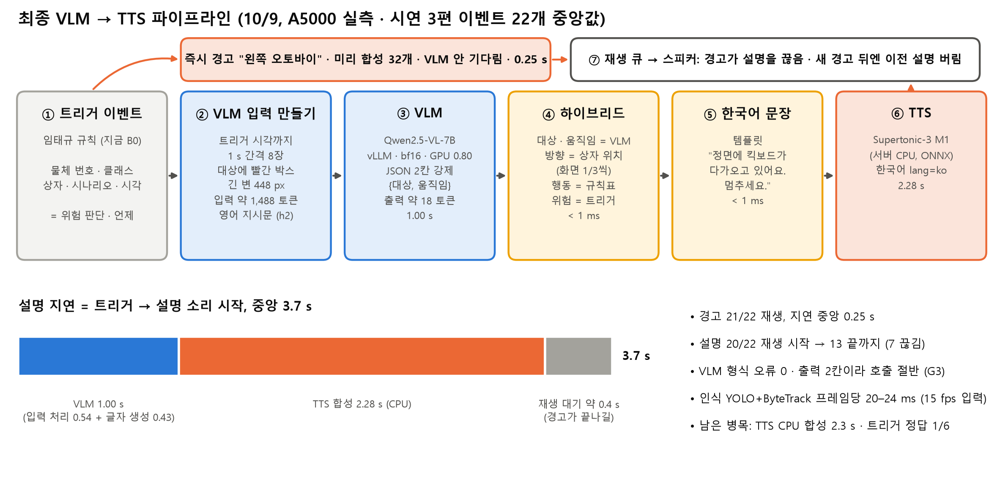

# VLM → TTS 파이프라인 — 최종 정리 (10/9)

작성 2026-10-09 · 담당 박상준 (트리거 이벤트 → VLM 입력 → VLM 출력 → 문장 → TTS → 재생)
근거: A5000 실제 end-to-end (흉내값 없음) — 시연 3편 `results/runtime/final_1009/` · 실험 G1 · G2 · G3 (`docs/16`)
위험 판단 · 언제 말할지는 트리거(임태규) 몫 (10/9 결정).

---

## 1. 단계별 입력 → 출력

| 단계 | 입력 | 하는 일 | 출력 | 누가 · 무엇으로 | 시간 (실측 중앙) | 코드 |
|---|---|---|---|---|---|---|
| ① 트리거 이벤트 | 매 프레임 YOLO E0 + ByteTrack 결과 (물체 번호 · 클래스 · 상자) | 언제 경고할지 판단 (지금 B0: 상자 제자리 + 면적 ×1.1) | 이벤트 {시각, 클래스, 물체 번호, 상자, 시나리오 S1–S4} | 임태규 규칙 (지금 B0) | 인식 20–24 ms + 트리거 28 ms / 프레임 | `runtime/triggers.py` |
| ② 분배기 | 이벤트 | 같은 물체 4 s · 같은 문장 3 s 중복 제거 → **즉시 경고** + **VLM 작업** 동시에 | 경고 문장 "방향 + 물체" · VLM 작업 | 코드 | < 1 ms | `runtime/dispatcher.py` |
| 즉시 경고 | 경고 문장 (32종 = 10클래스 × 3방향 + 신호 2) | 미리 합성한 소리 재생 (VLM 안 기다림) | 소리 | TTS 캐시 (영상 시작 전 M1로 32개 합성) | **0.25 s** | `runtime/speech.py` |
| ③ VLM 입력 만들기 | 최근 프레임 버퍼 · 이벤트 | 트리거 시각까지 **1 s 간격 8장**, 그 물체 상자가 있는 프레임에 **빨간 박스**, 긴 변 448 px | 이미지 8장 + 영어 지시문 `h2` | 코드 | < 50 ms | `runtime/vlm_worker.py` `build_inputs` |
| ④ VLM | 이미지 8장 (약 1,488 토큰) + 지시문 | 표시된 물체가 무엇이고 어떻게 움직이는지 | JSON **2칸** `{"target": 19종 중 1, "motion": 10종 중 1}` (출력 약 18 토큰) | **Qwen2.5-VL-7B**, vLLM, bf16, A5000 (GPU 80 %) | **1.00 s** (입력 처리 0.54 + 글자 생성 0.43) | `p0/describe.py` · `p0/prompts.py` |
| ⑤ 하이브리드 | VLM JSON + 이벤트 상자 · 시나리오 | 방향 = 상자 중심(화면 1/3씩) · 행동 = 규칙표(시나리오 × 방향 × 움직임) · 위험 = 트리거가 이미 판단 | 4칸 {대상, 방향, 움직임, 행동} | 코드 | < 1 ms | `runtime/vlm_worker.py` `hybrid` · `p0/ko_template.py` |
| ⑥ 한국어 문장 | 4칸 | 템플릿 "{방향}에 {대상}가 {움직임}. {행동}." | 예: "정면에 킥보드가 다가오고 있어요. 멈추세요." | 코드 | < 1 ms | `p0/ko_template.py` `sentence` |
| ⑦ TTS | 문장 | 한국어 음성 합성 (`lang=ko`) | wav | **Supertonic-3 M1** (서버 CPU, ONNX) | **2.28 s** | `runtime/speech.py` |
| ⑧ 재생 큐 | 경고 · 설명 소리 | 경고 우선, 경고가 설명을 끊음, 새 경고 뒤엔 이전 설명 버림, 마감(경고 2 s · 설명 6 s) 넘으면 버림 | 스피커 | 코드 | 대기 약 0.4 s | `runtime/audio.py` |
| 로그 · 시연 영상 | 모든 단계 기록 | 소리 · 상자 · 자막 + 오른쪽 단계별 패널 · VLM 입력 이미지 | `log.jsonl` · `demo.mp4` | 코드 | — | `runtime/render.py` |

**설명 지연 = 3.7 s** (트리거 → 설명 소리 시작) = VLM 1.0 + TTS 2.3 + 재생 대기 0.4

## 2. 지금 설정과 그렇게 정한 근거

| 항목 | 설정 | 근거 |
|---|---|---|
| VLM 모델 | Qwen2.5-VL-7B | 실험 A: 하이브리드 정확도 1위, 지연 0.94 s (5개 비교, 23개) · 3B는 G4에서 다시 비교 |
| VLM 출력 | **2칸 (대상 · 움직임)** | G3: 5칸 → 2칸으로 호출 0.96 → 0.49 s (단독), 완전 정답 0.09 → 0.30 |
| 위험 판단 | **트리거** (VLM `hazard` 안 씀) | G2: 지시문 4판 모두 VLM `hazard`가 정탐 · 오탐을 못 가름 (7B는 거의 항상 "아님", 다른 모델은 거의 항상 "위험") |
| 방향 · 행동 | 코드 (상자 · 규칙표) | 실험 A: 방향 VLM 0.65 vs 상자 0.91, 행동 VLM 0.22 vs 규칙 0.83 |
| 입력 프레임 | 1 s 간격 8장 + 빨간 박스 | VIABench Table 5 (8장에서 다수 모델 최고) · ViP-LLaVA (시각 프롬프트). 프레임 수 비교는 G8 |
| 지시문 언어 | 영어 | G2: 한국어 지시문과 결과 거의 같음 |
| TTS | Supertonic-3 M1 (서버 CPU) | 노트북 비교: 들어서 맞는 문장 54/55 (Heami 55/55는 Windows 전용) · 서버 GPU 후보는 G6 |
| 즉시 경고 | 미리 합성 | VLM을 기다리지 않음 → 0.25 s |

## 3. 시연 영상 3편 (`results/runtime/final_1009/<클립>/demo.mp4`)

화면: 왼쪽 원본 + 초록 상자(인식) · **빨간 굵은 상자(트리거 물체)** · 아래 자막 ([경고] 빨강 · [설명] 파랑) / 오른쪽 패널 ① 인식 ms · FPS → ② 트리거 → ③ VLM 입력 · 출력 → ④⑤ 문장 · TTS → ⑥ 재생 · 버림, 이벤트 뒤 3 s 동안 VLM에 들어간 8장.

| 영상 | 장면 | 이벤트 | 경고 | 설명 (VLM 문장 → 재생 시작 · 끊김 · 버림) | 들리는 설명 예 | 보여주는 것 |
|---|---|---|---|---|---|---|
| **c09** 점자블록 위 자전거 (50 s) | 길가 주차 오토바이 · 스쿠터 | 6 | 6 재생, 지연 0.34 s | 6 → 5 시작 (1 끊김) · 1 버림 | "정면에 킥보드가 있어요. 왼쪽으로 피하세요." (+4.0 s) · "정면에 킥보드가 다가오고 있어요. 멈추세요." | 경고 → 설명 흐름이 가장 잘 보임. 세워진 것을 "있어요"로 맞게 말한 경우와 "다가옴"으로 틀린 경우가 섞임 |
| **c06** 신호 대기 (58 s) | 횡단보도 신호 · 지나가는 차 | 9 | 9 재생, 지연 0.05 s | 9 → 9 시작 (4 끊김) | "빨간불로 바뀜" 경고 → "왼쪽 신호등이 빨간불이에요. 기다리세요." | 신호 바뀜 경고는 잘 나옴. 이벤트가 몰리면 설명이 경고에 자주 끊김. 어색한 문장도 보임 (아래 4-2) |
| **c04** 길가 주차 차량 (38 s) | 경로 옆 주차 차 | 7 (모두 오탐) | 6 재생 · 1 늦어서 버림, 지연 0.76 s | 7 → 6 시작 (2 끊김) · 1 버림 | "정면에 자동차가 멀어지고 있어요. 멈추세요." | **트리거 오탐**과 **CPU 경합에 의한 실시간 지연** (프레임 지연 중앙 1.35 s) |

합계 (3편, 이벤트 22): 경고 21/22 재생 · 지연 중앙 0.25 s · VLM 22회 중앙 1.00 s · 형식 오류 0 · 설명 22개 → 20개 재생 시작 (13개 끝까지 · 7개 새 경고에 끊김) · 2개 버림 · 설명 지연 중앙 3.7 s.

## 4. 잘되는 것 / 문제점

### 4-1. 잘되는 것

| 항목 | 근거 |
|---|---|
| **트리거 → VLM → TTS → 재생이 실제로 끊김 없이 연결됨** | 이벤트 22개 모두 VLM 호출 · JSON 형식 오류 0 · 문장 · 합성 · 재생 로그로 확인, VLM 입력 이미지 저장 |
| 즉시 경고가 VLM을 기다리지 않음 | 경고 지연 중앙 0.25 s (설명은 3.7 s) |
| 실시간 인식 | YOLO + ByteTrack 프레임당 20–24 ms → 입력 15 fps 유지 (VLM과 GPU를 나눠 쓸 때 p90 약 50 ms) |
| VLM 대상 인식 | 정답 23개 중 대상 0.83–0.87 (실험 A · G3) |
| 2칸 출력으로 VLM 호출 절반 | G3 단독 0.96 → 0.49 s, 실행 시스템 안에서 1.00 s (GPU 공유) |

### 4-2. 문제점

| # | 문제 | 증거 | 어디서 고치나 |
|---|---|---|---|
| 1 | **설명 지연 3.7 s 중 TTS 합성이 2.3 s** | M1 서버 CPU 합성 중앙 2.28 s | ⑦ TTS (다음 실험 N1) |
| 2 | **VLM 대상 ↔ 트리거 시나리오가 어긋나면 문장이 이상해짐** | 장애물(S2) 이벤트에 VLM이 "신호등" → "정면 신호등이 빨간불이에요. **왼쪽으로 피하세요.**" / 신호(S3) 이벤트에 "킥보드 · 멀어짐" → "킥보드가 멀어지고 있어요. **건너가세요.**" / "자동차가 멀어지고 있어요. 멈추세요." | ⑤ 하이브리드 규칙 (N2) |
| 3 | **VLM 움직임 인식이 약함** | 정답 23개 중 정지가 아닌 10개는 1–2개만 맞힘, 신호 "초록으로 바뀜" 거의 못 맞힘 (G3) | ③④ 입력 · 모델 (N4) |
| 4 | 이벤트가 몰리면 설명이 경고에 끊김 | c06 설명 9개 중 4개 끊김 | ⑧ 재생 정책 (N5) |
| 5 | **CPU 경합으로 실시간이 밀림** | c04 프레임 지연 중앙 1.35 s · 경고 지연 0.76 s — TTS(ONNX, CPU 전부 사용)와 트리거(CPU)가 겹침 | 스레드 배분 · TTS를 GPU로 (N3) |
| 6 | VLM 대상 ≠ YOLO 클래스가 잦음 | 시연 22개 중 14개 불일치 (오토바이 → 킥보드 등) | 어느 쪽을 믿을지 규칙 (N2) |
| 7 | (트리거, 임태규) 정답 대부분 놓침 · 세워진 차에 울림 | G1 정답 23개 중 3개 · 시연 정답 6개 중 1개 · c04 7개 모두 오탐 | 트리거 개선 (임태규) |
| 8 | 표본이 작음 | 정답 23개 · 움직이는 물체 0개 | VIABench · 팀 촬영 영상 (N6) |

## 5. 다음 실험 계획 (VLM → TTS 고도화)

| 순서 | ID | 실험 | 고치는 문제 | 방법 | 판단 기준 | 서버 시간 |
|---|---|---|---|---|---|---|
| 1 | **N1** | **설명 문장 전부 미리 합성** + 서버 TTS 비교 (G6) | #1 TTS 2.3 s | 설명 문장은 템플릿이라 가짓수가 유한(최대 1,476개, 실제로 나올 조합은 더 적음) → 32코어로 미리 합성해 캐시 → 설명 TTS 0 s. 함께 CosyVoice2 스트리밍 · GPU TTS 비교 (새 문장 대비) | 설명 지연 3.7 → 약 1.4 s · 받아쓰기 CER 유지 | 약 1 h |
| 2 | **N2** | 하이브리드 일관성 규칙 | #2 · #6 이상한 문장 | VLM 대상의 큰 분류(차량 · 장애물 · 신호등 · 계단)가 트리거 클래스와 다르면 → (a) 트리거 클래스로 문장 (b) 설명 생략 (c) VLM 대상 사용, 셋 비교 · 움직임 "멀어짐"이면 행동 "조심해서 가세요" 등 규칙표 보완 | 이상한 문장 0, 완전 정답 유지 | GPU 불필요 (로그 재채점) |
| 3 | **N3** | CPU · GPU 자원 배분 (G9) | #5 실시간 밀림 | TTS 스레드 수 제한 (`OMP_NUM_THREADS`) · 트리거와 코어 분리 · TTS GPU 실행 · 3B로 바꿨을 때 | 프레임 지연 중앙 < 0.1 s · 경고 지연 < 0.3 s (c04 · c06) | 약 30분 |
| 4 | **N4** | VLM 입력 (G8) | #3 움직임 · 신호 바뀜 | 프레임 1 · 3 · 8 · 32장, 간격 0.5 · 1 s, 신호등 크롭, 대상 크롭 + 전체 | 움직임 · 신호 바뀜 정답률 | 약 1 h |
| 5 | **N5** | 재생 정책 | #4 끊김 | 같은 물체 설명은 끊지 않기 · 짧은 설명(대상 + 움직임만) · 설명 마감 조정 | 끝까지 들린 설명 비율 | GPU 불필요 |
| 6 | **N6** | 7B vs 3B 확정 (G4) | #8 표본 | VIABench 장애물 관련 약 8,000개, 2칸 하이브리드, McNemar | 7B가 유의하게 높으면 7B, 아니면 3B (2배 빠름) | 2–5 h (+66 GB) |
| 7 | N7 | 출력 정합성 (G7) | 소리로 내용 전달 | 4칸 → 문장 → TTS → Whisper → 4칸 복원율 | 복원율 | 약 10분 |
| — | (팀) | 움직이는 물체 데이터 | #3 · #8 | 팀 촬영 영상 라벨 (S1) | — | — |
| — | (임태규) | 트리거 개선 | #7 | 경로 띠 · 상자 아래 끝(가까움) · 배경 확대율(FOE) 비교 | 정답 맞힘 · 오탐/분 | — |

추천: 다음 서버 대여 때 **N1 → N3 → N2** (설명 지연 3.7 → 약 1.4 s, 실시간 안정, 문장 오류 제거) — 토요일 회의 이후.
