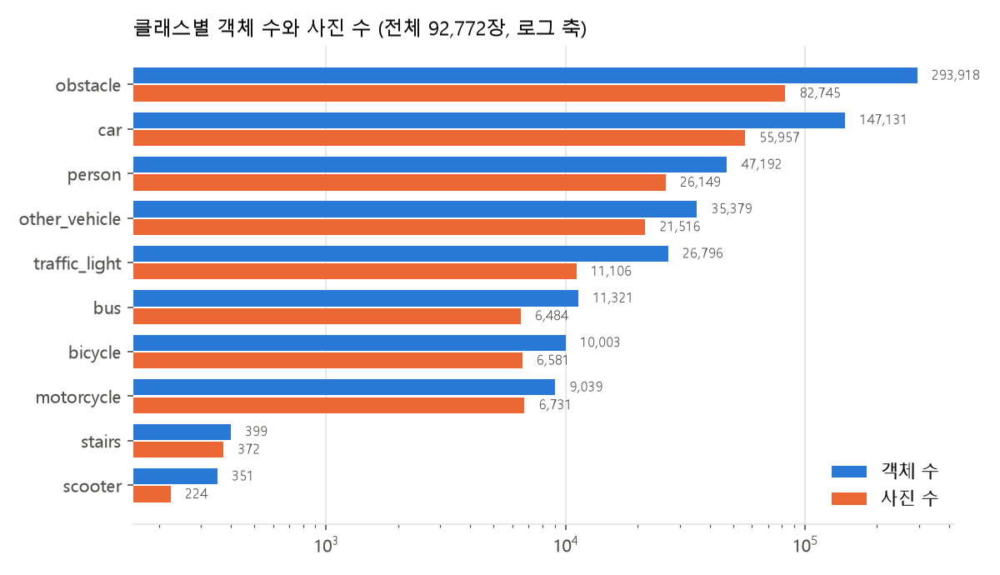
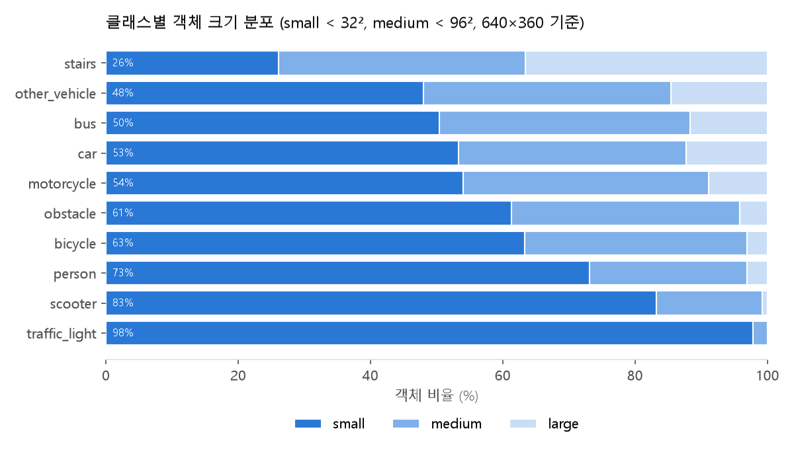

# 데이터 분석: AI Hub 189 인도 보행 영상 (10클래스 재라벨링)

`python analyze_data.py --jsonl labels_all.jsonl --out analysis`로 생성. 이미지 없이 라벨 파일만으로 계산하며,
train/val/test 분할과 pilot 샘플은 `build_dataset.py`와 같은 함수·seed로 다시 만들어 실험에 쓴 데이터와 숫자가 같다.

## 1. 전체 규모

| 항목 | 값 |
|---|---|
| 라벨된 사진 | 92,772장 |
| 영상(폴더) | 1,955개 (영상당 사진 평균 47.5장, 최대 293장) |
| 객체(폴리곤) | 581,529개 (사진당 평균 6.3개) |
| 객체가 하나도 없는 사진 | 0장 |
| 원본 zip | Polygon P1~P14 92,400장, Surface S1 372장 |
| 해상도 | 원본에서 긴 변 640px로 줄여 학습 |

## 2. train / val / test 분할

영상 단위로 70 / 15 / 15 분할(같은 영상의 프레임이 서로 다른 split에 섞이지 않음). 50개 seed 중 val·test에서
가장 드문 클래스가 가장 많이 들어가는 seed(34)를 자동 선택.

| split | 영상 | 사진 | 객체 |
|---|---|---|---|
| train | 1,368 | 64,952 | 403,570 |
| val | 293 | 14,099 | 90,024 |
| test | 294 | 13,721 | 87,935 |

## 3. 클래스별 분포 (전체)

객체 수는 폴리곤 개수, 사진 수는 그 클래스가 하나 이상 들어간 사진 수. 한 사진에 신호등이 3개 있으면 객체 3, 사진 1.

| 클래스 | 객체 | 사진 | 영상 | 사진당 객체(평균) | 사진당 객체(최대) |
|---|---|---|---|---|---|
| obstacle | 293,918 | 82,745 | 1,840 | 3.55 | 37 |
| car | 147,131 | 55,957 | 1,800 | 2.63 | 24 |
| person | 47,192 | 26,149 | 1,691 | 1.8 | 17 |
| other_vehicle | 35,379 | 21,516 | 1,681 | 1.64 | 21 |
| traffic_light | 26,796 | 11,106 | 1,374 | 2.41 | 15 |
| bus | 11,321 | 6,484 | 1,323 | 1.75 | 16 |
| bicycle | 10,003 | 6,581 | 1,367 | 1.52 | 11 |
| motorcycle | 9,039 | 6,731 | 1,261 | 1.34 | 11 |
| stairs | 399 | 372 | 115 | 1.07 | 5 |
| scooter | 351 | 224 | 124 | 1.57 | 22 |

- 가장 드문 클래스: scooter (사진 224장, 영상 124개), stairs (사진 372장, 영상 115개), bus (사진 6484장, 영상 1323개).
- 가장 많은 obstacle과 가장 적은 scooter의 객체 수 차이는 약 837배.
- COCO 사전학습에 이미 있는 클래스: person, bicycle, motorcycle, car, bus, traffic_light. COCO에 없는 클래스: scooter, other_vehicle, obstacle, stairs.

### split별 (객체 / 사진)

| 클래스 | train | val | test |
|---|---|---|---|
| person | 32,735 / 18,008 | 7,283 / 4,087 | 7,174 / 4,054 |
| bicycle | 6,969 / 4,566 | 1,434 / 984 | 1,600 / 1,031 |
| scooter | 197 / 144 | 60 / 47 | 94 / 33 |
| motorcycle | 6,292 / 4,692 | 1,353 / 1,014 | 1,394 / 1,025 |
| car | 102,448 / 39,117 | 22,117 / 8,533 | 22,566 / 8,307 |
| bus | 7,526 / 4,331 | 1,817 / 1,015 | 1,978 / 1,138 |
| other_vehicle | 24,645 / 14,984 | 5,417 / 3,246 | 5,317 / 3,286 |
| obstacle | 203,896 / 57,977 | 46,482 / 12,645 | 43,540 / 12,123 |
| stairs | 264 / 247 | 56 / 53 | 79 / 72 |
| traffic_light | 18,598 / 7,750 | 4,005 / 1,676 | 4,193 / 1,680 |

## 4. 객체 크기

마스크 면적을 사진 면적 대비 비율로 계산. COCO 기준(32px, 96px)을 640×360 프레임에 맞춰 small < 0.44%, medium < 4.00%.

| 클래스 | 면적 중앙값(%) | small(%) | medium(%) | large(%) |
|---|---|---|---|---|
| traffic_light | 0.041 | 97.8 | 2.2 | 0.0 |
| scooter | 0.124 | 83.2 | 16.0 | 0.9 |
| person | 0.18 | 73.1 | 23.8 | 3.1 |
| bicycle | 0.256 | 63.3 | 33.6 | 3.1 |
| obstacle | 0.308 | 61.3 | 34.5 | 4.2 |
| motorcycle | 0.38 | 54.0 | 37.1 | 9.0 |
| car | 0.386 | 53.3 | 34.4 | 12.3 |
| bus | 0.438 | 50.4 | 37.9 | 11.7 |
| other_vehicle | 0.483 | 48.0 | 37.4 | 14.7 |
| stairs | 2.307 | 26.1 | 37.3 | 36.6 |

## 5. 알아둘 점

- **stairs는 전부 Surface(S1.zip)에서 나옴** (S1.zip 372장). Polygon 원본에는 계단 클래스가 없어서,
  Polygon 영상에 찍힌 계단은 배경으로 학습됨. stairs AP가 실제보다 낮거나 불안정할 수 있음.
- **scooter는 사진 224장, 영상 124개뿐.** 영상 단위 분할이라 test에는 33장만 들어가 test AP 변동이 큼.
- **traffic_light는 작은 객체 비율이 높음** (small 97.8%). 640px 입력에서 놓치기 쉬움.

## 6. 실험별로 실제 쓴 데이터

### 1차 pilot (10클래스, 2026-10-01)

클래스마다 그 클래스가 들어간 사진을 약 200장(val은 100장) 뽑음. 사진 수 기준이며 객체 수가 아님.
train 996장, val 443장. 결과는 [`README.md`](../README.md) 참고.

### 최종 학습 (5클래스: scooter, stairs, obstacle, other_vehicle, traffic_light)

- 라벨: 위 5개만 남기고 나머지(person, bicycle, motorcycle, car, bus)는 제거.
- train: scooter·stairs·traffic_light가 들어간 train 사진 **전부** + obstacle·other_vehicle은 사진 200장 이상 되도록(이미 충족해서 추가 0장) → **8,120장**.
- val: 클래스당 사진 약 100장 → 267장 (best epoch 선택용).
- test: 전체 test 13,721장 (5클래스 객체가 없는 사진 997장은 배경 이미지로 포함).
- train 사진 중 5클래스가 1개만 있는 사진 482장, 2개 5,926장, 3개 이상 1,712장.

| 클래스 | train 객체 / 사진 | val 객체 / 사진 | test 객체 / 사진 |
|---|---|---|---|
| scooter | 197 / 144 | 60 / 47 | 94 / 33 |
| stairs | 264 / 247 | 56 / 53 | 79 / 72 |
| obstacle | 35,116 / 7,556 | 790 / 203 | 43,540 / 12,123 |
| other_vehicle | 3,146 / 1,778 | 158 / 100 | 5,317 / 3,286 |
| traffic_light | 18,598 / 7,750 | 250 / 100 | 4,193 / 1,680 |

## 7. 원본 라벨 → 10클래스 매핑 (AI Hub 원본 개수)

| 원본 라벨 | 객체 | 사진 | → 클래스 |
|---|---|---|---|
| car | 147,132 | 55,957 | car |
| pole | 98,463 | 57,432 | obstacle |
| tree_trunk | 97,018 | 44,494 | obstacle |
| person | 47,192 | 26,149 | person |
| traffic_sign | 38,918 | 21,298 | (사용 안 함) |
| bollard | 37,266 | 13,906 | obstacle |
| truck | 33,211 | 20,190 | other_vehicle |
| traffic_light | 26,799 | 11,107 | traffic_light |
| movable_signage | 20,203 | 12,059 | obstacle |
| bus | 11,321 | 6,484 | bus |
| bicycle | 10,003 | 6,581 | bicycle |
| motorcycle | 9,039 | 6,731 | motorcycle |
| potted_plant | 8,031 | 4,390 | obstacle |
| bench | 6,215 | 3,225 | obstacle |
| power_controller | 5,262 | 3,446 | obstacle |
| barricade | 4,323 | 1,991 | obstacle |
| stop | 4,311 | 3,720 | obstacle |
| traffic_light_controller | 3,986 | 3,469 | obstacle |
| chair | 3,643 | 2,101 | obstacle |
| fire_hydrant | 2,593 | 2,290 | obstacle |
| carrier | 1,479 | 1,159 | other_vehicle |
| table | 1,317 | 860 | obstacle |
| kiosk | 1,198 | 947 | obstacle |
| stroller | 485 | 429 | other_vehicle |
| scooter | 351 | 224 | scooter |
| wheelchair | 204 | 176 | other_vehicle |
| dog | 166 | 151 | (사용 안 함) |
| parking_meter | 92 | 69 | obstacle |
| cat | 51 | 45 | (사용 안 함) |

Surface(S1)에서는 계단 라벨만 stairs로 사용.
