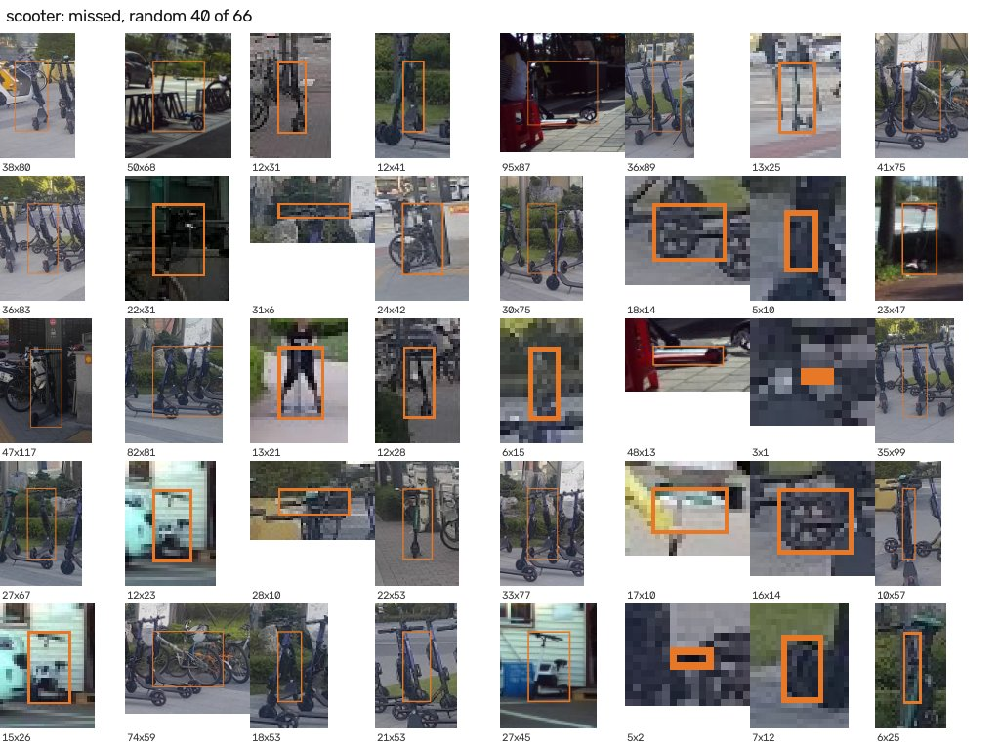
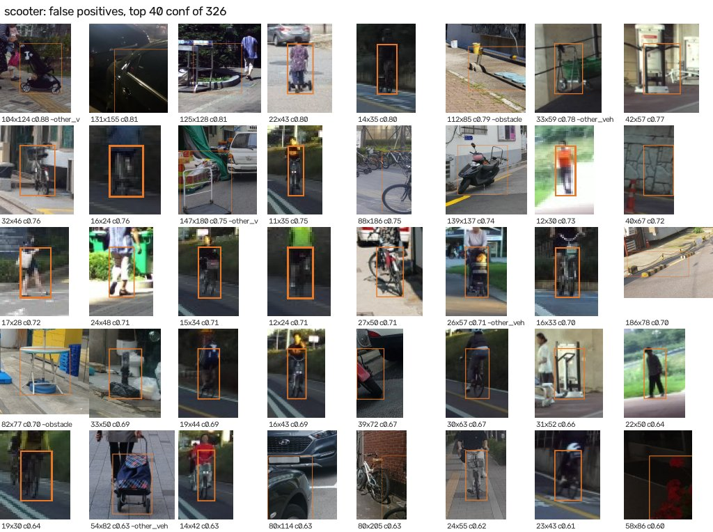
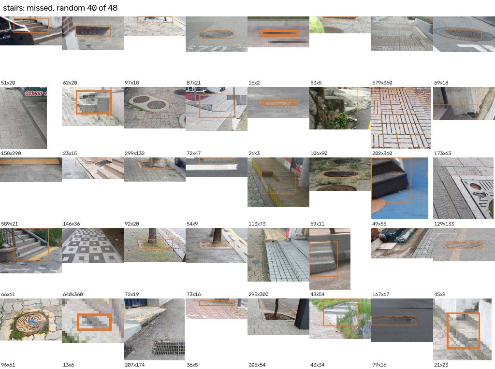
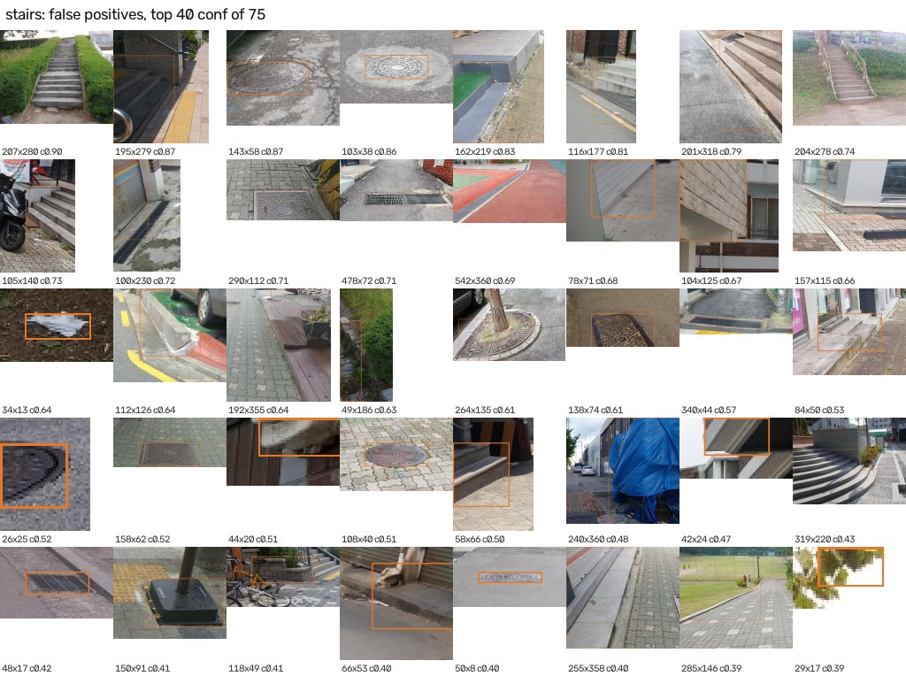
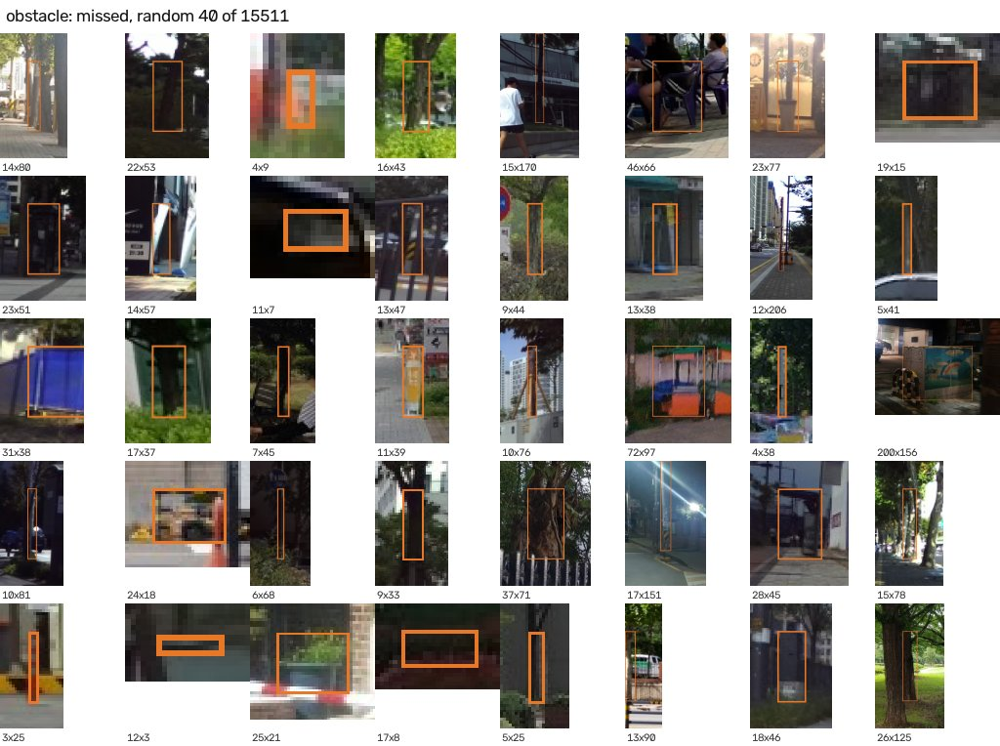
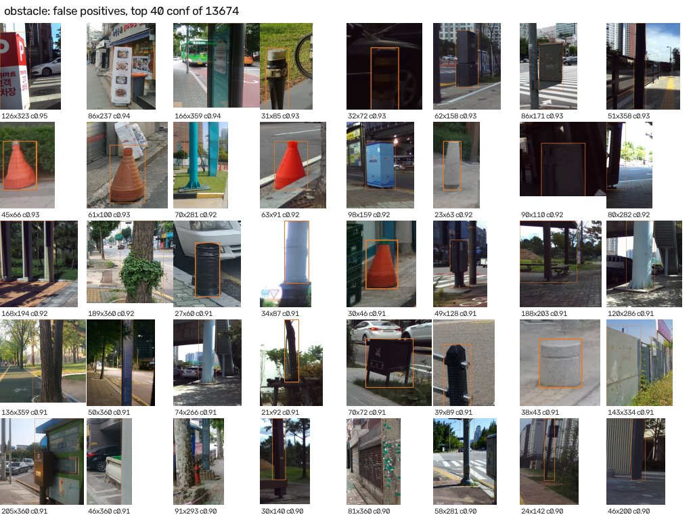
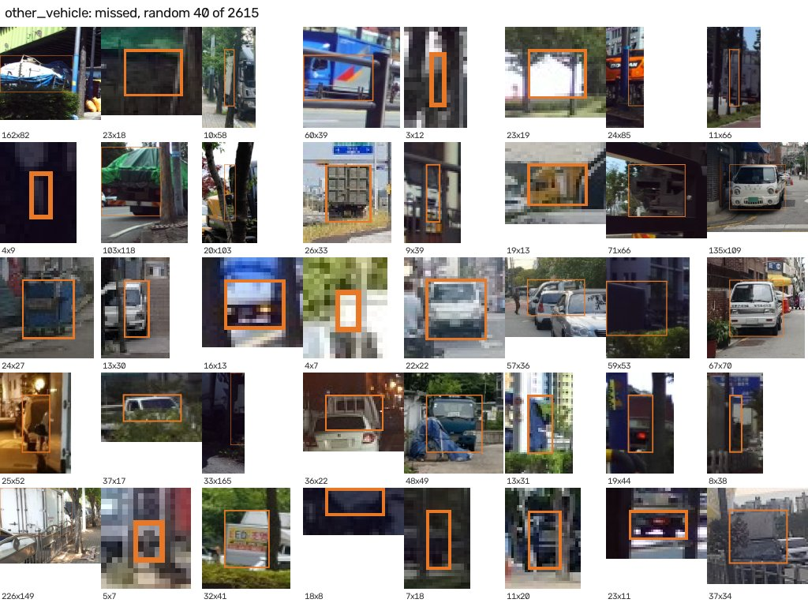
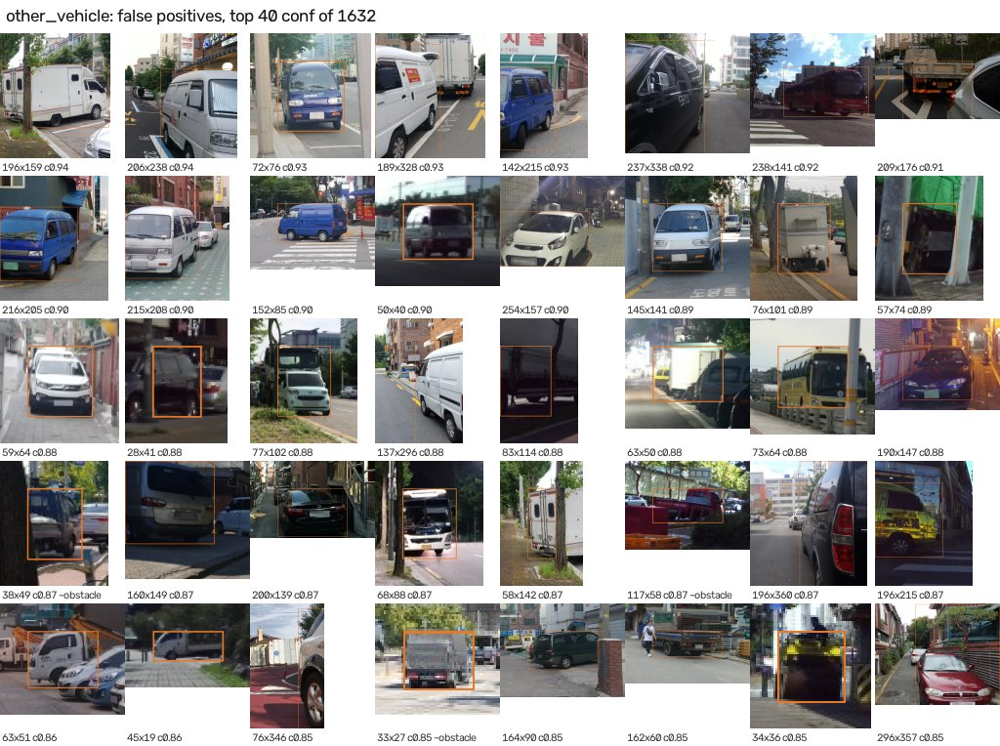
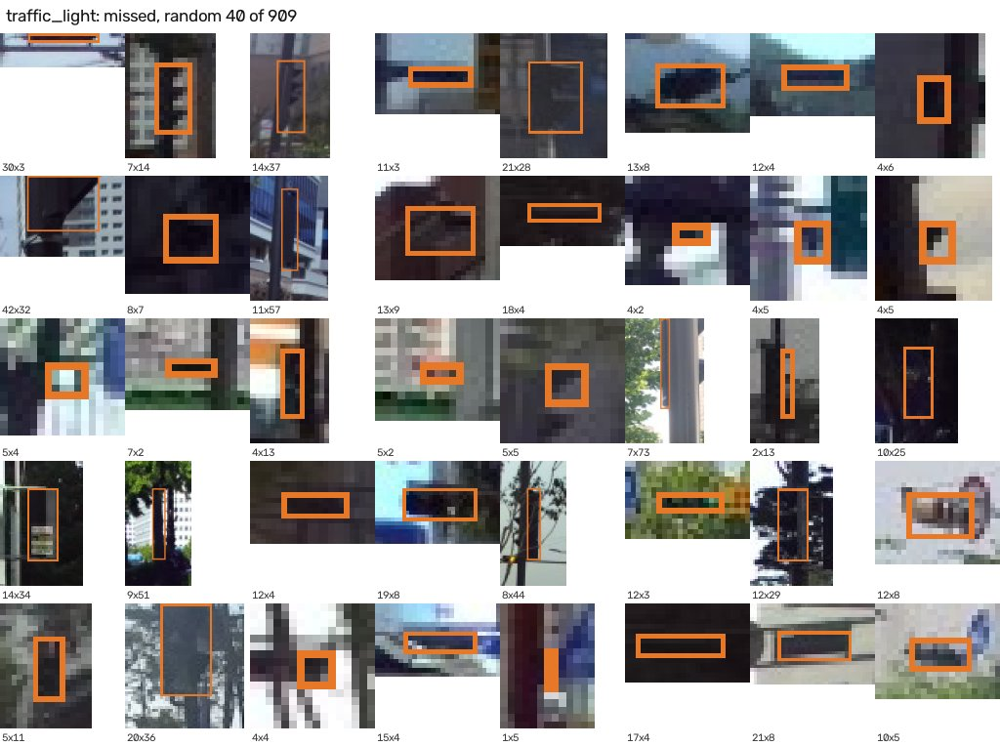
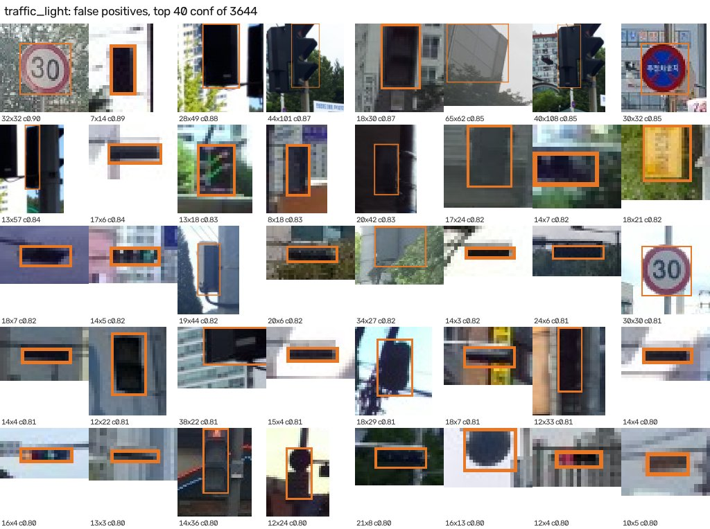

# 오류 분석: `runs/final/E0_s0/weights/best.pt`

test 13,721장. 기준: confidence ≥ 0.25, 같은 클래스 박스 IoU ≥ 0.5면 '찾음'. AP는 모든 confidence를 훑지만, 여기서는 한 지점에서 찾은 것 / 놓친 것 / 잘못 찾은 것을 센다.

## 1. 클래스별 요약

| 클래스 | 정답 객체 | 찾음(recall %) | 오검출(FP) | 정답 1개당 FP | precision % | FP 중 다른 클래스 정답과 겹침 % |
|---|---|---|---|---|---|---|
| scooter | 94 | 28 (29.8) | 326 | 3.47 | 7.9 | 9.5 |
| stairs | 79 | 31 (39.2) | 75 | 0.95 | 29.2 | 0.0 |
| obstacle | 43,540 | 28,029 (64.4) | 13,674 | 0.31 | 67.2 | 0.5 |
| other_vehicle | 5,317 | 2,702 (50.8) | 1,632 | 0.31 | 62.3 | 2.3 |
| traffic_light | 4,193 | 3,284 (78.3) | 3,644 | 0.87 | 47.4 | 0.6 |

## 2. 크기별 recall (박스 짧은 변, 640px 기준)

| 클래스 | 0~8px | 8~16px | 16~32px | 32~64px | 64px 이상 |
|---|---|---|---|---|---|
| scooter | 0.0% (n=11) | 10.5% (n=19) | 23.1% (n=26) | 48.1% (n=27) | 63.6% (n=11) |
| stairs | 0.0% (n=6) | 0.0% (n=8) | 26.7% (n=15) | 28.6% (n=14) | 63.9% (n=36) |
| obstacle | 40.6% (n=7,452) | 63.8% (n=15,671) | 72.7% (n=12,395) | 75.2% (n=5,847) | 73.3% (n=2,175) |
| other_vehicle | 1.9% (n=311) | 14.8% (n=677) | 45.1% (n=1,571) | 61.9% (n=1,358) | 74.8% (n=1,400) |
| traffic_light | 75.5% (n=2,707) | 82.3% (n=1,114) | 86.6% (n=322) | 91.5% (n=47) | 33.3% (n=3) |

## 3. 잘림 · 밝기 · 카메라별 recall

| 클래스 | 잘리지 않음 | 잘림 | 밝음(≥50) | 어두움(<50) | 스마트폰 | ZED |
|---|---|---|---|---|---|---|
| scooter | 27.3% (n=88) | 66.7% (n=6) | 28.7% (n=87) | 42.9% (n=7) | 28.8% (n=80) | 35.7% (n=14) |
| stairs | 22.6% (n=31) | 50.0% (n=48) | 39.2% (n=79) | - | 39.2% (n=79) | - |
| obstacle | 58.0% (n=30,725) | 79.6% (n=12,815) | 65.9% (n=33,516) | 59.4% (n=10,024) | 63.9% (n=22,971) | 64.9% (n=20,569) |
| other_vehicle | 47.0% (n=4,348) | 68.1% (n=969) | 54.0% (n=4,374) | 36.1% (n=943) | 57.0% (n=3,257) | 41.0% (n=2,060) |
| traffic_light | 78.1% (n=3,923) | 81.5% (n=270) | 79.6% (n=2,827) | 75.6% (n=1,366) | 82.4% (n=1,326) | 76.5% (n=2,867) |

## 4. 예시 (파란 박스. 놓친 것 = 정답 위치, 오검출 = 예측 위치, c = confidence, ~클래스 = 겹친 다른 정답)

### scooter: 놓친 객체 (66개 중 무작위 40)

### scooter: 오검출 (confidence 상위 40 / 326개)

### stairs: 놓친 객체 (48개 중 무작위 40)

### stairs: 오검출 (confidence 상위 40 / 75개)

### obstacle: 놓친 객체 (15,511개 중 무작위 40)

### obstacle: 오검출 (confidence 상위 40 / 13,674개)

### other_vehicle: 놓친 객체 (2,615개 중 무작위 40)

### other_vehicle: 오검출 (confidence 상위 40 / 1,632개)

### traffic_light: 놓친 객체 (909개 중 무작위 40)

### traffic_light: 오검출 (confidence 상위 40 / 3,644개)

테스트 이미지 중 클래스가 하나라도 있는 사진 수: scooter 33, stairs 72, obstacle 12,123, other_vehicle 3,286, traffic_light 1,680
