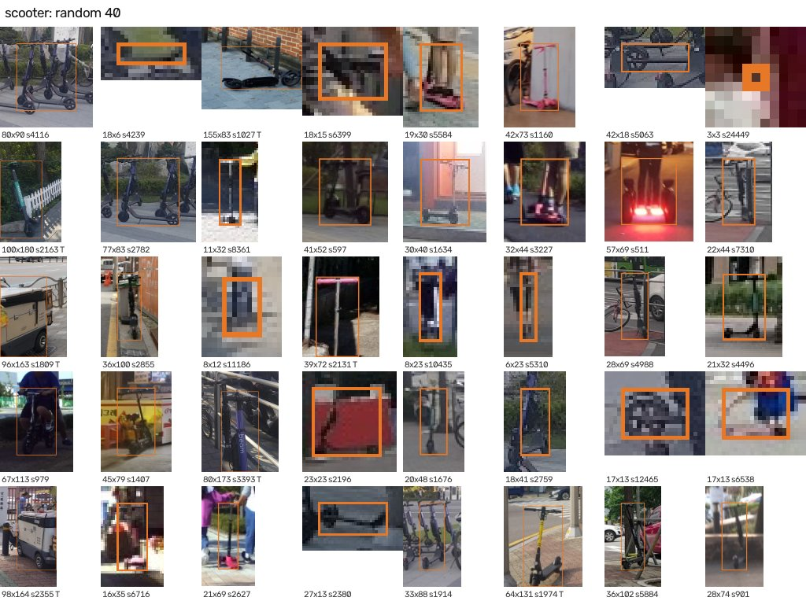
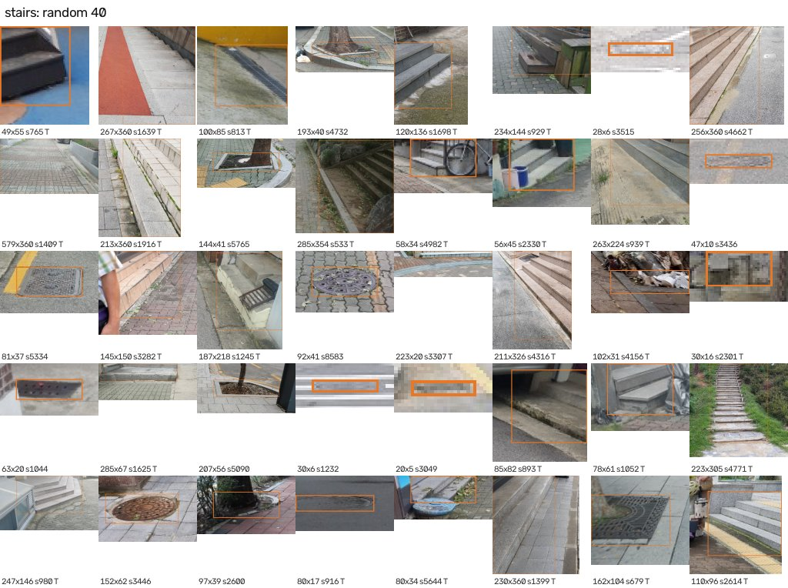
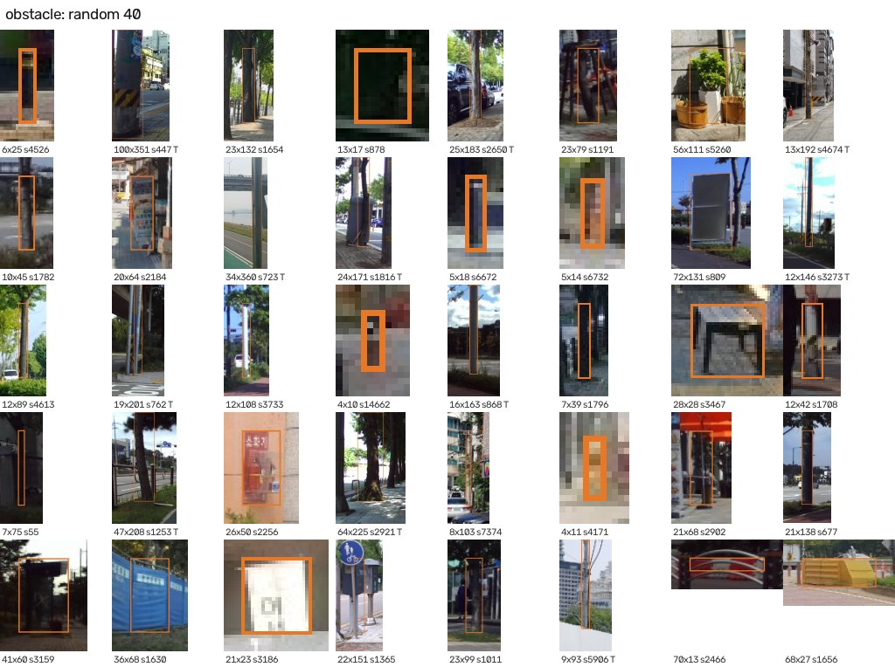
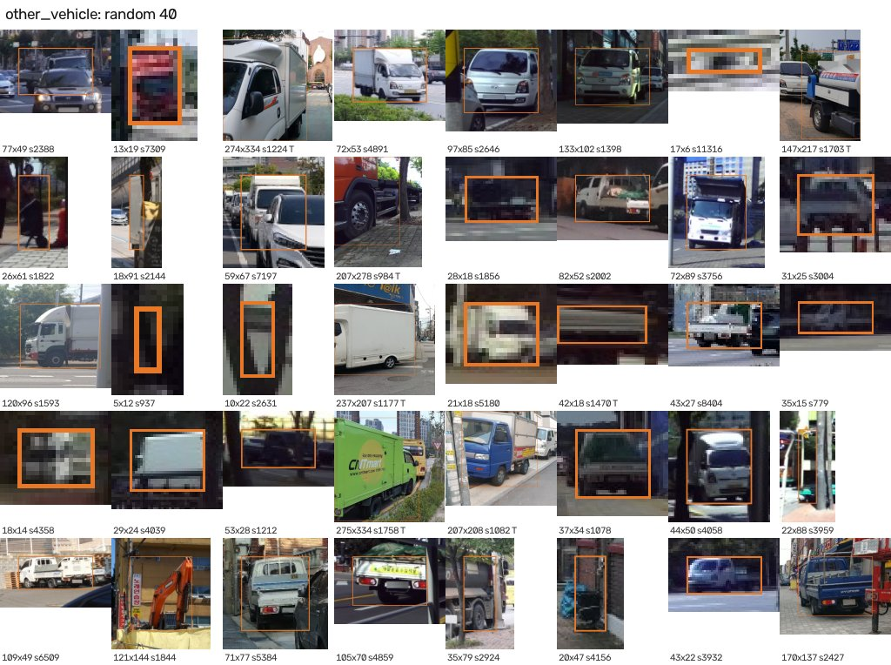
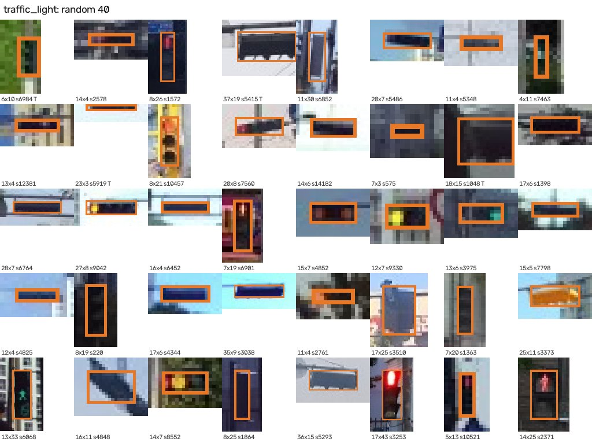
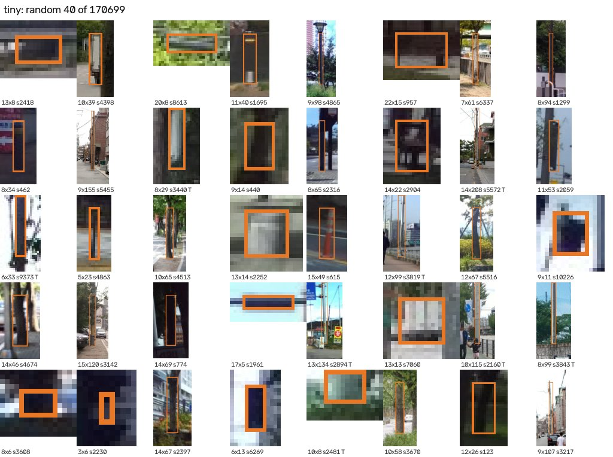
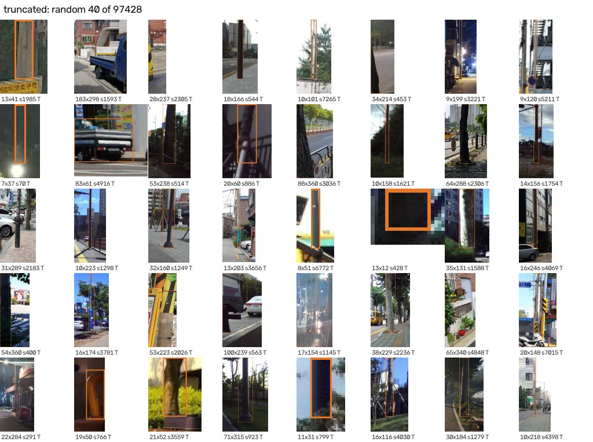
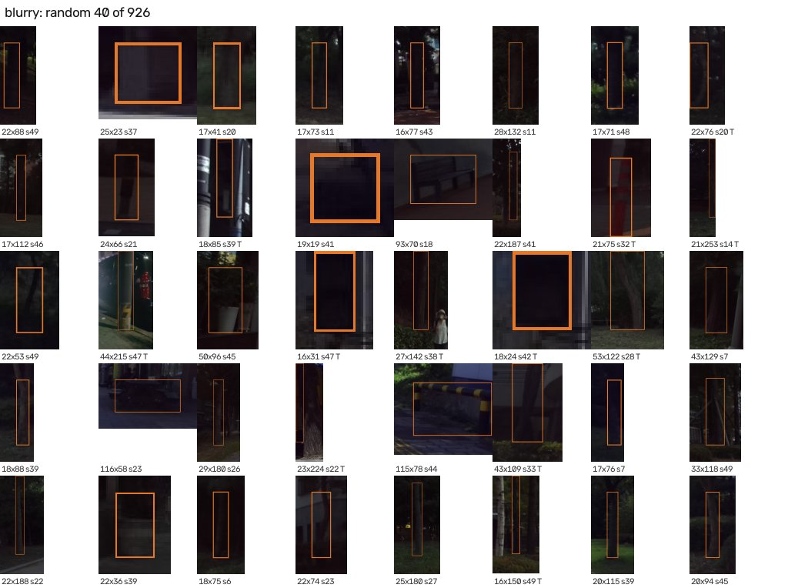
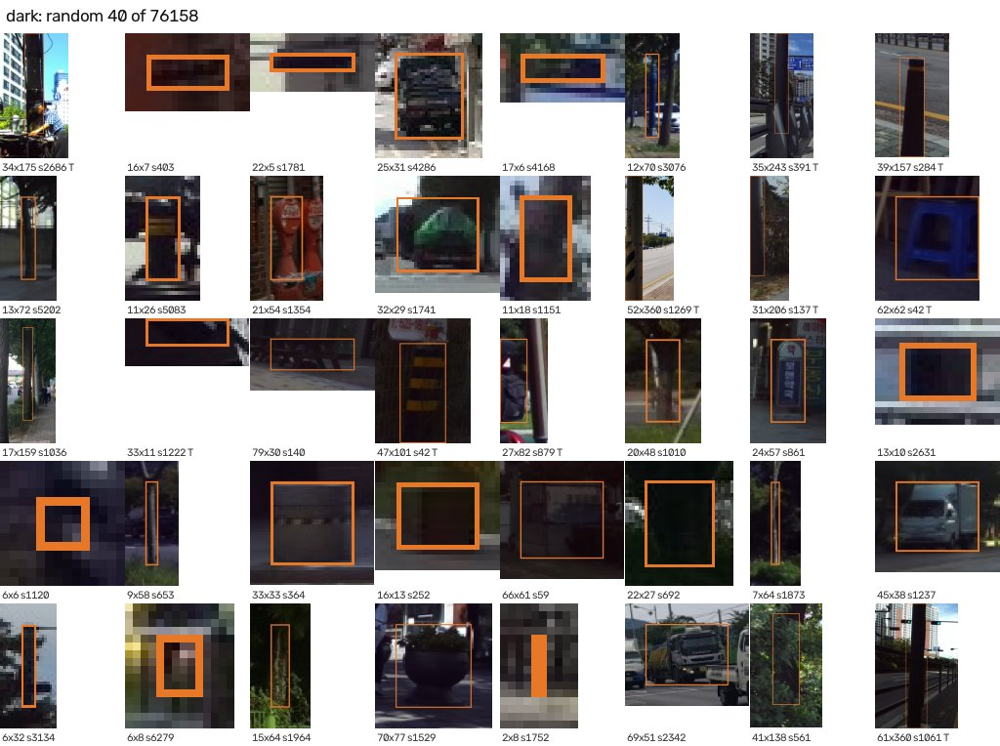

# 객체 품질 분석 (실제 이미지 기준)

`python analyze_objects.py`로 생성. 학습에 쓰는 640px 이미지에서 모든 라벨 객체를 직접 측정.

- **잘림**: 폴리곤이 사진 가장자리에 닿음 (프레임 밖으로 잘린 객체)
- **아주 작음**: 객체 박스의 짧은 변 < 16px (640px 입력 기준)
- **흐림**: 객체 박스 안 Laplacian 분산 < 50 (낮을수록 흐림. 기준은 아래 예시 이미지로 눈으로 확인)
- **어두움**: 객체 박스 안 평균 밝기 < 50 (0~255)

전체 프레임: 선명도 중앙값 1414.4, 흐린 프레임(< 50) 0.0%, 어두운 프레임(< 50) 0.4%

| 클래스 | 객체 | 박스 짧은 변 중앙값(px) | 아주 작음(%) | 잘림(%) | 흐림(%) | 어두움(%) | 선명도 중앙값 |
|---|---|---|---|---|---|---|---|
| obstacle ★ | 293,918 | 16.0 | 47.9 | 30.3 | 0.6 | 21.6 | 2135.1 |
| other_vehicle ★ | 35,379 | 34 | 16.6 | 17.4 | 0.1 | 15.3 | 3112.0 |
| scooter ★ | 351 | 25 | 30.8 | 7.1 | 0.0 | 17.4 | 3143.6 |
| stairs ★ | 399 | 70 | 15.8 | 65.4 | 0.0 | 0.0 | 2182.8 |
| traffic_light ★ | 26,796 | 8.0 | 88.8 | 6.8 | 0.1 | 26.9 | 4330.0 |
| bicycle | 10,003 | 29 | 20.2 | 12.0 | 0.1 | 26.5 | 3504.3 |
| bus | 11,321 | 29 | 21.1 | 18.7 | 0.1 | 15.8 | 3053.2 |
| car | 147,131 | 30 | 18.9 | 17.0 | 0.0 | 13.4 | 4088.1 |
| motorcycle | 9,039 | 33 | 13.9 | 11.6 | 0.0 | 22.0 | 3488.2 |
| person | 47,192 | 18.0 | 39.0 | 5.9 | 0.2 | 24.2 | 2708.3 |

★ = 5클래스 최종 모델의 대상 클래스

## 학습/평가 split별 (5클래스)

| 클래스 | split | 객체 | 아주 작음(%) | 잘림(%) | 흐림(%) |
|---|---|---|---|---|---|
| scooter | train | 197 | 27.9 | 7.1 | 0.0 |
| scooter | val | 60 | 41.7 | 8.3 | 0.0 |
| scooter | test | 94 | 29.8 | 6.4 | 0.0 |
| stairs | train | 264 | 16.7 | 66.3 | 0.0 |
| stairs | val | 56 | 12.5 | 67.9 | 0.0 |
| stairs | test | 79 | 15.2 | 60.8 | 0.0 |
| obstacle | train | 203,896 | 47.7 | 30.7 | 0.5 |
| obstacle | val | 46,482 | 48.9 | 29.4 | 0.6 |
| obstacle | test | 43,540 | 48.1 | 29.4 | 0.6 |
| other_vehicle | train | 24,645 | 16.7 | 17.3 | 0.0 |
| other_vehicle | val | 5,417 | 17.1 | 17.1 | 0.0 |
| other_vehicle | test | 5,317 | 15.6 | 18.2 | 0.2 |
| traffic_light | train | 18,598 | 89.2 | 6.8 | 0.0 |
| traffic_light | val | 4,005 | 86.7 | 7.6 | 0.2 |
| traffic_light | test | 4,193 | 88.9 | 6.4 | 0.4 |

## 실제 객체 예시 (무작위 40개, 파란 박스 = 라벨, 아래 숫자 = 박스 크기 / 선명도 / T=잘림)

### scooter

### stairs

### obstacle

### other_vehicle

### traffic_light

## 문제 유형별 예시 (5클래스)

### 아주 작은 객체 (170,699개)

### 잘린 객체 (97,428개)

### 흐린 객체 (926개)

### 어두운 객체 (76,158개)

