# 보행신호등·킥보드 데이터 구축 + YOLO(seg10) 이어 학습 + 신호 상태 분류

> 이 문서 하나로 후임자가 질문 없이 이어받을 수 있도록 정리한 인수인계 문서입니다.
> 마지막 갱신: 2026-10-10. 학습 결과는 [§7](#7-학습-결과)에 있고, 학습이 끝나면 자동으로 채워 넣을 예정입니다.
> 상세 작업 기록은 `HANDOFF.md`에 있습니다.

---

## 0. 한눈에 보기

| 항목 | 내용 |
|---|---|
| 목표 | 한국 **보행자 신호등**과 **킥보드**를 기존 보행 보조 YOLO 모델에 추가로 학습한다. 신호 상태(빨강/초록)도 판정한다 |
| 기준 모델 | `aihub189_yolo/runs/seg10/weights/best.pt`. **yolo11n-seg**, AI Hub 189 인도보행 2,000장으로 학습, 10클래스 |
| **확정 사항** | ① seg10 `best.pt`를 **그대로 이어서** 학습한다 ② **클래스 10개를 유지**하고 새 클래스는 만들지 않는다 ③ **기존 모델로 재라벨링(pseudo-label)하지 않는다** ④ 실제 출력은 bbox만 쓴다 |
| 클래스 | `0 person, 1 bicycle, 2 scooter, 3 motorcycle, 4 car, 5 bus, 6 other_vehicle, 7 obstacle, 8 stairs, 9 traffic_light` |
| 새 데이터 매핑 | 신호등 → `traffic_light`(9), 킥보드/PM → `scooter`(2). 원래 라벨에서 해당 클래스만 쓴다 |
| 신호 상태 | 별도 분류 모델 **yolo11n-cls**를 쓴다. `red / green / off / vehicle` 4개 클래스 |
| 신호 변화 강조 | 71579 데이터에서 보행신호 red↔green 변화가 있는 클립 157개의 프레임을 학습에 반복해 넣었다. 탐지 모델은 5배, 분류 모델은 3배 |
| 학습 장소 | 런유어AI(몬드리안 AI) **RTX A5000 24GB** 서버 |
| 결과 위치 | 구글 드라이브 `aihub_ped_kick_yolo/runs_server/` (`seg10_plus_tl_scooter`, `signal_state_cls`) |
| 데이터 위치 | 구글 드라이브 `aihub_신호등_킥보드/<데이터셋>/<split>/shard_*.zip` (약 1GB, 무압축 zip) |
| 코드/기록 | 구글 드라이브 `aihub_traffic_code/` = 이 저장소, PC `C:\Users\windo\aihub_traffic\` |

---

## 1. 전체 구조

```
[AI Hub API] --스트리밍(원본 저장 없이)--> pipeline.py --필요한 이미지+라벨만--> shard zip --rclone--> [Google Drive]
                                                                                      |
[Roboflow API] -- 샘플을 눈으로 보고 한국 보행신호만 선별 --> rf_to_yolo.py --------------+
                                                                                      v
                                   [런유어AI A5000] server_run.sh
                                     ├ prepare_yolo.py  : shard → YOLO seg 데이터셋 (bbox → 사각형 폴리곤)
                                     ├ build_189.py     : 기존 189 데이터 2,000장(폴리곤) 그대로 포함
                                     ├ rf_to_yolo.py    : Roboflow 한국 보행신호 5종 + 킥보드
                                     ├ oversample.py    : 신호 변화 클립 프레임 ×5 (train_list.txt)
                                     ├ train_seg.py     : YOLO(seg10 best.pt).train(...)  ← 탐지(+마스크)
                                     ├ build_cls.py / train_cls.py : 신호 상태 분류 (동시에 실행)
                                     └ infer.py         : 탐지 → traffic_light 영역 crop → 상태 분류
```

---

## 2. 데이터 조사 결과 (AI Hub)

### 2-1. 검토한 데이터셋과 판정

| ID | 이름 | 형식 | 보행신호/킥보드 라벨 | 판정 |
|---|---|---|---|---|
| **188** | 신호등/도로표지판 인지(수도권) | jpg + JSON, 묶음(tar)별 6~9GB | `traffic_light.type ∈ {car, pedestrian, bus, ...}`, `attribute[{red,green,yellow,left_arrow,x_light,others_arrow: on/off}]` | ✅ 핵심 데이터 |
| **71579** | 자율주행차 신호등 신호정보 | jpg 1920×1080 + JSON, **클립 단위(클립당 5프레임)** | `pedestrian_signal`, `attribute.signal ∈ {red, green, etc}`, `flags.v2`(신호 변화 시나리오) | ✅ 신호 변화 장면용 |
| **614** | 개인형 이동장치 안전 데이터 | jpg + JSON | `annotations.PM[]` bbox `[x,y,w,h]`, `PM_code` | ✅ 킥보드. Validation만 사용 |
| 71784 | 생활도로 객체인식 | png + COCO형 JSON | Personal Mobility(99) 있음. 신호등에 보행/차량 구분 없음 | ❌ 614가 훨씬 효율적이라 제외 |
| 71786 | 전국 도로시설물 | jpg + COCO | 교통신호기만 있고 보행/차량 구분 없음 | ❌ |
| 71572 | AI 신호 최적화 | CCTV + CSV/XML | 차량 6종만 있음 | ❌ |
| 187 | 신호등/표지판(수도권 외) | 188과 같음 | 188과 같음 | ⏸ **이용 신청 미승인**. 승인되면 `rank_files.py 187`로 추가 가능 |
| 189 | 인도보행 영상 | 이미지+xml 같은 zip | traffic_light(구분 없음), scooter | 기존 모델 학습에 쓰인 데이터 |
| 513, 522, 159 | 보행시설물 / 교차로 신호체계 / 1인칭 보행 | — | 신호색 없음, 신호 현시 데이터 등 | ❌ |

### 2-2. 188: 보행신호 분포 (라벨 전수 집계, `rank.csv`)

| split | 묶음 | 전체 이미지 | 보행신호 포함 이미지 | 보행신호 객체 |
|---|---|---|---|---|
| Training (전체 44묶음) | 44 | 884,825 | 178,229 | 284,114 |
| **Training 중 사용(1280×720 19묶음, 110GB)** | 19 | — | **98,445** | 150,723 |
| **Validation (전체)** | 9 | 110,900 | **22,043** | 34,462 |

- **1280×720 묶음을 고른 이유**: GB당 보행신호 이미지가 800~1,270장으로, 다른 해상도 묶음(250~600장)보다 2~4배 많다.
- 보행신호 상태 분포는 Training 일부 묶음(약 3만 객체) 기준으로 다음과 같다.

| 상태 | 비율 |
|---|---|
| 모두 off | **약 70%** |
| red on | 약 23% |
| green on | 약 6% |

- off의 정체는 아래 사진처럼 **신호등 옆면이나 뒷면**이 찍힌 경우가 대부분이다. 실제로 꺼진 신호가 아니다.

| off로 표시된 보행신호 crop (옆면/뒷면) | red로 표시된 보행신호 crop |
|---|---|
| 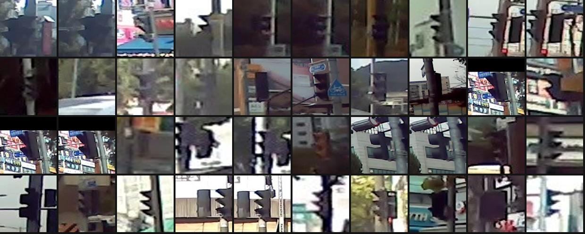 | 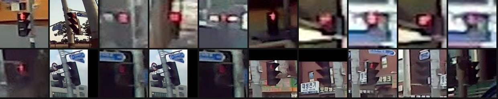 |

### 2-3. 71579: 신호 변화 장면

- 보행신호가 나오는 클립은 Validation 기준 **718개**이고, 그중 **157개에서 상태가 바뀐다**(`clips_pedestrian_signal.csv`).
- **한계 1. 클립당 프레임이 5장뿐**이고 간격이 고르지 않다(예: 002, 004, 011, 030, 039번 프레임). 연속 동영상이 아니다.
- **한계 2. 보행신호가 작다.** 차량 앞 카메라에서 찍어서 수십 픽셀 크기다.
- **한계 3. 변화 횟수에 가짜가 섞여 있다.** 다른 신호등이 화면에 새로 들어온 경우도 변화로 집계됐다.
- Training(분할 zip 249GB)은 효율이 낮아 제외했다.

| Clip_0556 (red → green → off) | Clip_0574 |
|---|---|
| 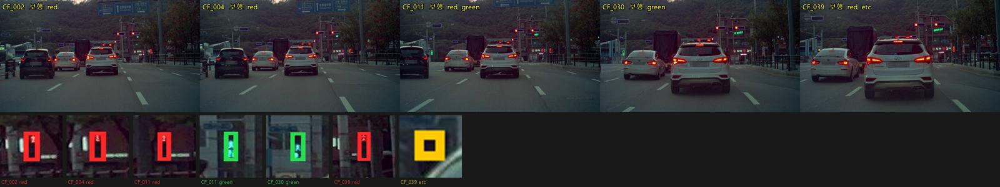 | 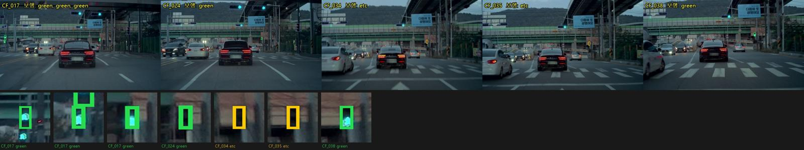 |

### 2-4. 614: 킥보드
- Validation 라벨 56,423장 **전부**에 PM 박스가 있다. 원천은 VS1 하나(39GB)다.
- **PM 박스는 탑승자와 킥보드를 함께 감싼다**(아래 사진의 주황 박스). 189와 kdigital의 scooter 박스는 기구만 감싼다 → [§6](#6-남은-문제--다음-할-일) 참고.

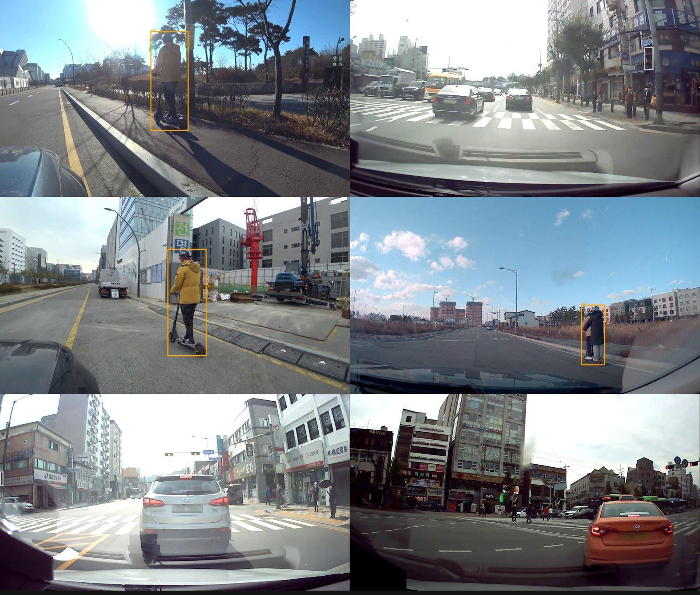

---

## 3. 데이터 조사 결과 (Roboflow, AI Hub 외)

검색 API(`rf_search.py`)로 후보를 모았다. 그다음 **데이터셋마다 샘플 12장을 박스와 함께 그려서 눈으로 국가를 판정했다**(`rf_sample.py`).
판단 근거는 한글 간판·표지판, 한국식 보행등(잔여시간 표시기, 빨간 서 있는 사람 도트) 등이다.

### 3-1. ✅ 사용 (한국 보행신호등이 확실한 것만)
| 데이터셋 | 변환 이미지 / 박스 | 국가 근거 | 샘플 |
|---|---|---|---|
| `crosswalk-traffic-light/robot-hsuip` | 1,236 / 1,236 | KB국민은행 거리, 보행자 시점 | 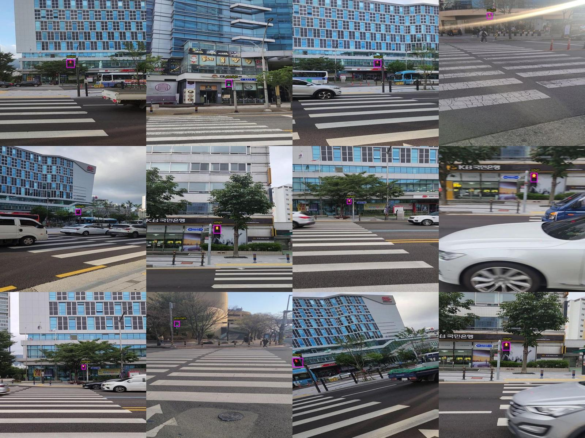 |
| `chanyoung/pedestrian-light-crosswalk` | 1,057 / 1,067 | 여의대로 표지판 | 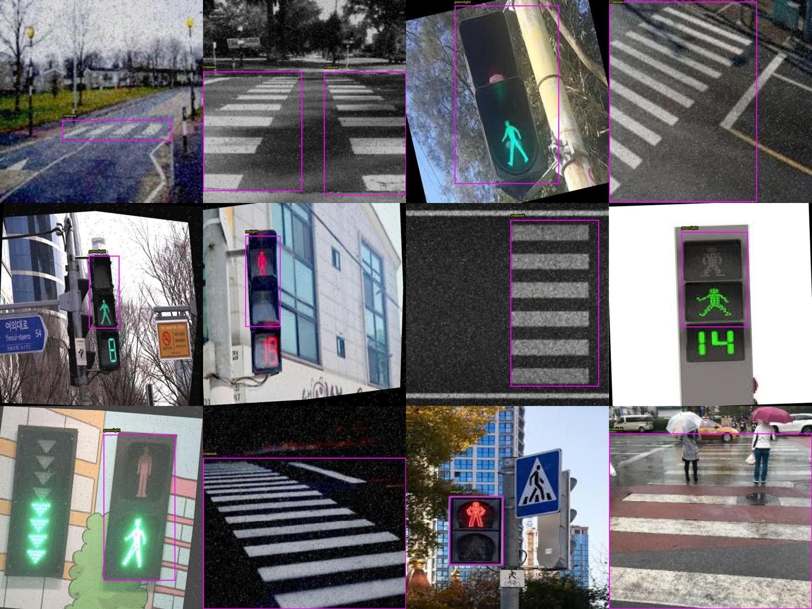 |
| `cap-8nhra/crosswalk-pedestrian-light` | 122 / 128 | 선곡초 앞, 한국어 음향신호기 안내문 | 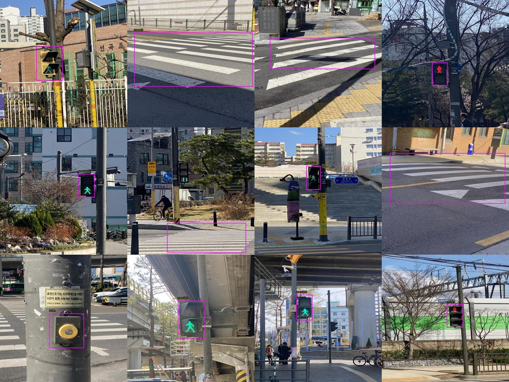 |
| `usrg2/pedestrian-signal-p6xjj` | 522 / 522 | 청운대 앞 | 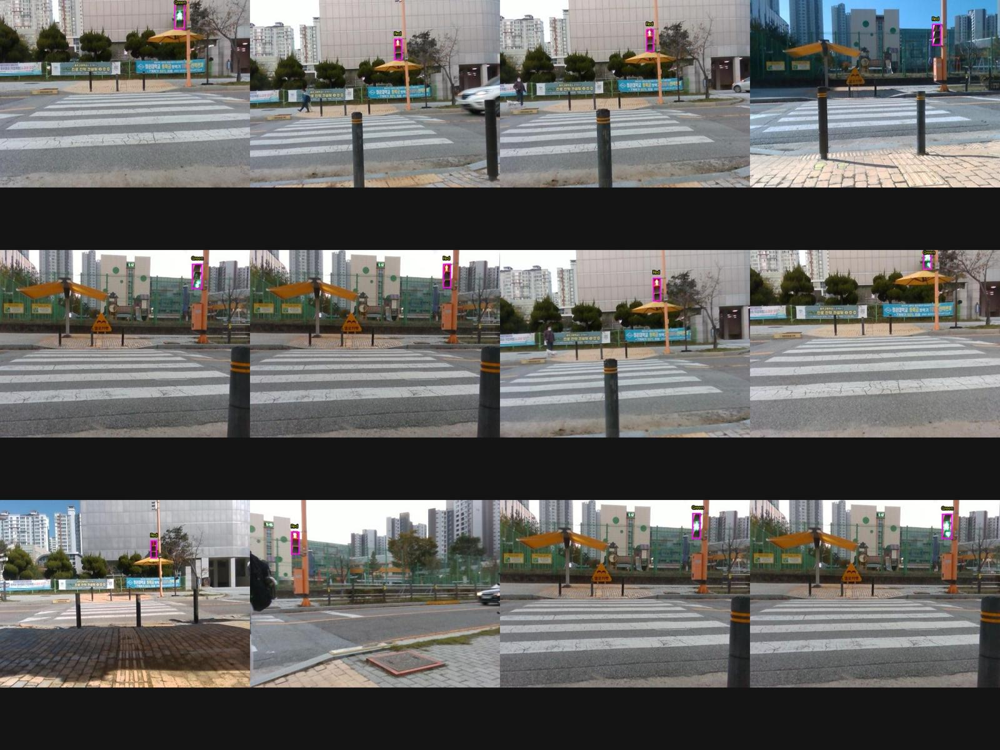 |
| `s-workspace-ddokc/pedestrian-signal` | 1,718 / 1,903 | 영남대역, 연원로 | 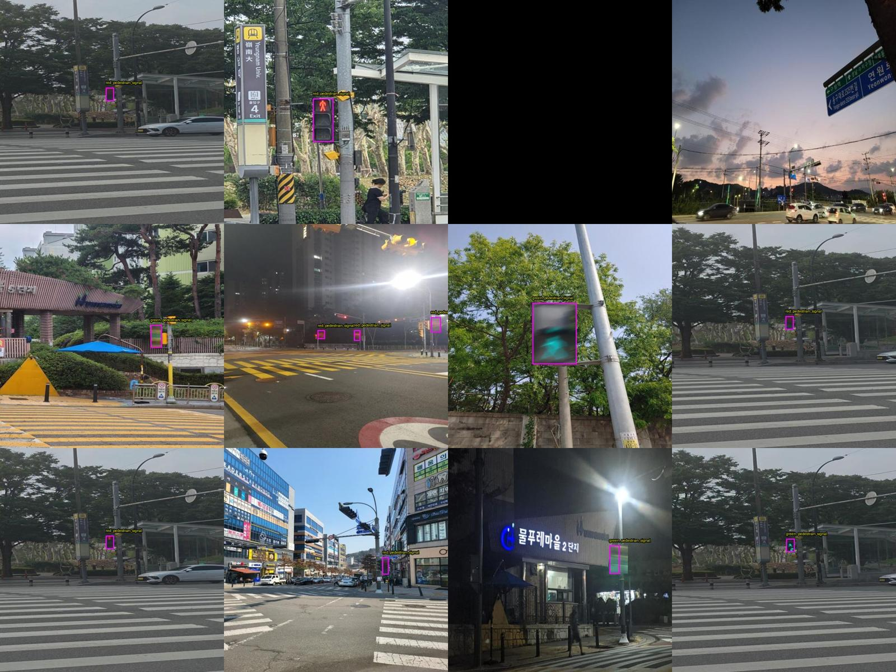 |
| `kdigital/electric-scooter-cd7hw` (킥보드) | 4,939 / 6,770 | 한국 뉴스 사진 위주, 박스가 기구만 감쌈 | 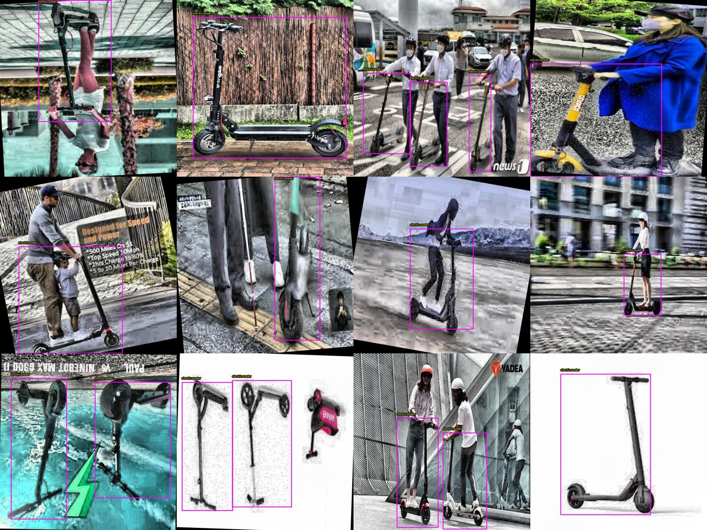 |

### 3-2. ❌ 제외
| 데이터셋 | 이유 |
|---|---|
| `pedestrian-traffic-signal/pedestrian-signal-lights-d2upo` (13k) | **대만**(번체 간판, 대만 택시) 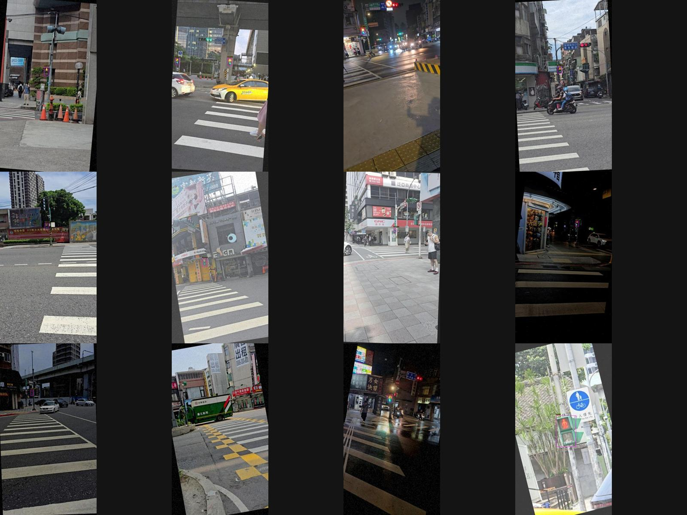 |
| `obb-bhjmx/pedestrian-traffic-light-e1zx9` | **홍콩** 거리뷰 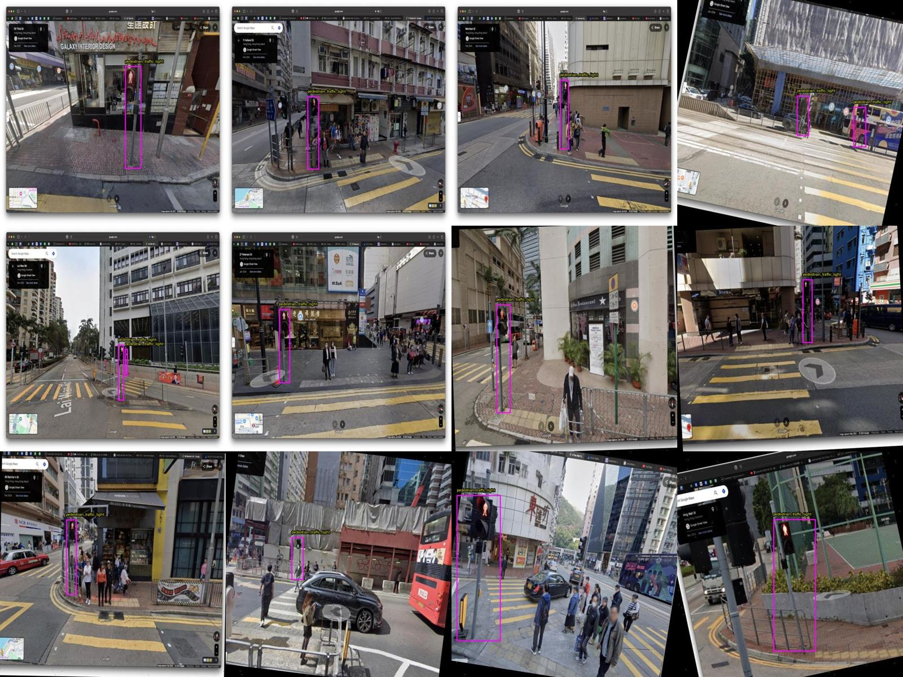 |
| `s-workspace-cosh1/pedestrian-traffic-light-pbbl6` | 한국·일본·대만 웹 이미지가 섞임 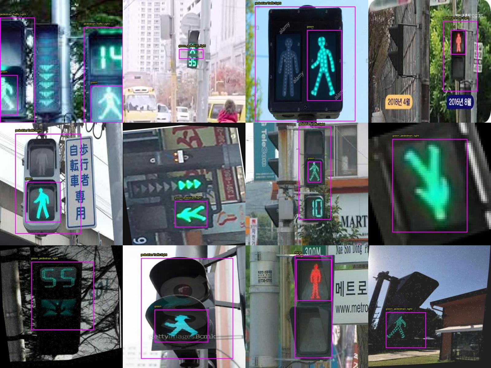 |
| `cible/pedestrian-traffic-light-3p4dd` (2,555) | 대부분 한국이지만 일부 외국 신호등이 섞임 → "정확히 한국만" 기준으로 제외. **넣을지는 결정 필요** 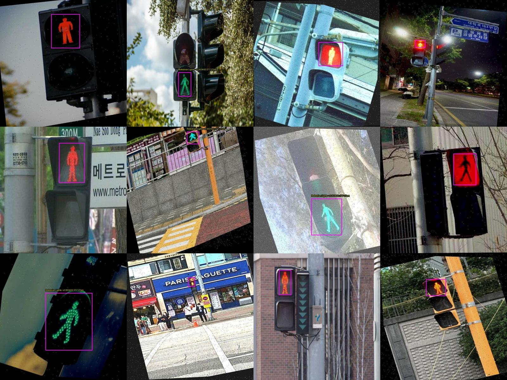 |
| `cv-workspace-2oidl`, `project-xmdfq`, `pedestrain-light-crossing`, `traffic-light-gp1ey`, `crosswalk-signal-detection`, `keirishan-balachandran`, `ono-gedd7`, `project-wdkej` | 각각 중국, 터키, 유럽, 인도네시아(차량신호), 미국·독일·일본, 스리랑카, 여러 나라 섞임 |
| `min-yong-park/original-korean-traffic-light` | 한국이지만 **차량 신호등** 데이터 |

---

## 4. 최종 학습 데이터 구성 (탐지, 10클래스 seg)

| 출처 | train | val | 라벨 |
|---|---|---|---|
| 189 인도보행(기존) | 해시 90% (약 1,800) | 10% (약 200) | 10클래스 폴리곤 원본 그대로 |
| 188 Training 1280×720 | 해시 샘플 **30,000** | – | traffic_light (차량 + 보행 전부) |
| 188 Validation | – | 해시 샘플 **3,000** | traffic_light |
| 71579 Validation | 718클립 × 5프레임 ≈ 3,590 | – | traffic_light(신호등 4종) |
| 614 Validation | **20,000** (video_id 해시 90%) | 약 2,200 | scooter (탑승자 포함 박스) |
| Roboflow 한국 보행신호 5종 | 약 90% | 약 10% | traffic_light |
| Roboflow kdigital 킥보드 | 약 90% | 약 10% | scooter |
| **신호 변화 강조** | 변화 클립 157개 프레임 ×5 | – | `train_list.txt`에 중복 기재 |

**실제 생성 결과 (2026-10-10 02:00, 서버 `~/work/ds`)**
- AI Hub 변환(`prepare_yolo.py`)
  - train 53,552장 / val 5,222장
  - 박스: train traffic_light 154,276, scooter 35,795 / val traffic_light 12,366, scooter 3,791
- 189 원본 2,000장 추가
- Roboflow 추가
  - 한국 보행신호 4,654장(4,855박스)
  - 킥보드 4,926장(6,754박스)
- **최종: train 63,948장, val 6,406장**
- 학습 목록(`train_list.txt`)은 67,052줄이다. 신호 변화 프레임 776장을 5배로 넣었다.
- epoch당 5,158 iteration이고, A5000에서 약 22분 걸린다(GPU 70%, 9.6GB).
- 상태 분류 crop 중간 집계: off 40,000(상한), vehicle 40,000(상한), red 약 27,000, green 약 7,500 → **green이 적다(불균형)**

- 새 데이터의 bbox는 **사각형 폴리곤**으로 저장한다(`c x1 y1 x2 y1 x2 y2 x1 y2`). seg 데이터에 bbox 줄이 섞이면 Ultralytics가 폴리곤을 전부 버리기 때문이다.
- 차량 신호등도 `traffic_light`로 넣었다. 189의 traffic_light가 "신호등" 전체를 뜻하기 때문이다. 보행/차량 구분은 상태 분류 모델의 `vehicle` 클래스가 맡는다.
- 학습 설정
  - 초기 가중치 `seg10/best.pt`. **시험 학습에서 561/561 항목이 그대로 이어지는 것을 확인했다.**
  - imgsz 1280(보행신호가 작아서), epochs 30, patience 8, batch auto, save_period 1
- 신호 상태 분류: crop 96px. 188(상태 attribute), 71579(signal), Roboflow 5종(red/green)에서 만든다. 클래스별 최대 4만 장이고 변화 클립 crop은 ×3이다.

---

## 5. 실행 방법

### 5-1. 다운로드 (서버 권장)
```bash
# 서버: ~/work/code 에 이 저장소 + aihub_apikey.txt, ~/.config/rclone/rclone.conf(gdrive 리모트) 필요
bash ~/work/code/server_download.sh      # 188 Validation 1줄 + 188 Training 2줄 + rclone 업로더
bash ~/work/code/status.sh               # 진행 상황
```
- `pipeline.py` 환경변수
  - `AIHUB_TAG`: 작업별 진행 기록 이름
  - `AIHUB_JOBS`: 받을 대상. 예: `188:Training`
  - `AIHUB_OUT`: 드라이브 직접 쓰기
- 진행 기록 파일은 `state_<tag>.json`(끝난 묶음), `saved_<tag>.txt`(저장된 파일), `keep/`(라벨 판정 캐시), `claims/`(여러 작업이 묶음을 나눠 받기)다.
- 강제로 멈췄다면 `python3 migrate.py <tag...>`로 미완성 shard를 정리한 뒤 다시 실행한다.

### 5-2. 학습 (서버)
```bash
nohup bash ~/work/code/server_run.sh > ~/work/run.log 2>&1 &   # 다시 실행하면 이어서 진행
```
### 5-3. 추론
```bash
python3 infer.py <탐지 best.pt> <분류 best.pt> <이미지|폴더|영상> --save out/
# traffic_light 박스 → signal:red / signal:green / signal:off / signal:vehicle 로 표시
```

### 5-4. 서버 접속 (런유어AI)
- 접속 명령: `ssh -i <pem> ubuntu@machine.runyour.ai`
- **긴 명령은 반드시 `nohup ... &`로 실행**한다. 서버가 오래 걸리는 SSH 세션을 끊는다.
- python은 `python3`만 있다. rclone은 `~/bin/rclone`에 있다.

---

## 6. 남은 문제 / 다음 할 일

| # | 문제 | 영향 | 권장 조치 |
|---|---|---|---|
| 1 | **부분 라벨**: 188, 614, Roboflow 이미지에 사람·차 라벨이 없다(재라벨링 금지 방침) | person/car가 배경으로 학습되어 해당 클래스 성능이 떨어질 수 있다 | 189 val의 클래스별 mAP를 기존 seg10(person 0.670, car 0.836)과 비교한다. 떨어졌다면 189 비중을 늘리거나 새 데이터 비율을 줄인다 |
| 2 | **scooter 박스 정의 불일치**: 614는 탑승자 포함, 189와 kdigital은 기구만 | scooter 박스 위치가 흔들리고 mAP가 떨어진다 | 614를 제외하거나 비중을 줄인 버전과 비교한다 |
| 3 | traffic_light에 차량 신호등까지 포함 | 의도한 설계다. 보행/차량은 분류 모델 `vehicle`로 구분 | 분류 모델 혼동행렬에서 vehicle↔off 혼동을 확인한다 |
| 4 | 188 보행신호의 70%가 off(옆면/뒷면) | 분류 모델 클래스 불균형 | 클래스별 최대 4만 장 상한을 걸었다. 결과를 보고 off 비중을 조정한다 |
| 5 | 71579 신호 변화는 5프레임 클립뿐이고 가짜 변화가 섞임 | 신호 변화 강조 효과가 제한적이다 | 실제 연속 영상(직접 촬영 등)으로 보강한다 |
| 6 | 187 미승인 | 수도권 외 보행신호가 빠져 있다 | AI Hub에서 이용 신청 → `rank_files.py 187` → 상위 묶음 추가 |
| 7 | cible(2,555장) 보류 | 한국 보행신호 데이터를 더 쓸 수 있다 | 외국 이미지를 걸러내고 포함할지 결정한다 |
| 8 | rclone 공용 client_id 퇴역 경고 | 드라이브 업로드가 막힐 수 있다 | 개인 Google client_id를 발급해 `rclone config`에 넣는다 |
| 9 | **v2 학습 진행 중** (2026-10-10 오후) | 기존 클래스(bicycle, other_vehicle 등) 하락을 회복하기 위한 것 | `server_v2.sh`: v1 best.pt에서 15 epoch 추가 학습. 189 ×10, 188 1만, 614 5천 장, lr0 0.002. 끝나면 `docs_v2/RESULTS.md`가 자동 생성됨(드라이브 `aihub_traffic_code/docs_v2`) |

---

## 7. 학습 결과

**✅ 학습 완료 (2026-10-10 12:00).**
- 최종 가중치: 드라이브 `aihub_ped_kick_yolo/runs_server/seg10_plus_tl_scooter/weights/best.pt` (best epoch 24)
- 상태 분류: `runs_server/signal_state_cls/weights/best.pt`
- 전체 표: [`docs/RESULTS.md`](docs/RESULTS.md)

### 7-1. 핵심 결과 (같은 검증 이미지에서 seg10 vs 새 모델, Box mAP50)
| 검증셋 | 클래스 | seg10(기존) | **새 모델** |
|---|---|---|---|
| 189 인도보행 (181장) | **traffic_light** | 0.461 | **0.785** ⬆ |
| 188 보행신호 도로 (3,000장) | traffic_light | 0.039 | **0.725** ⬆ |
| Roboflow 한국 보행신호 | traffic_light | 0.022 | **0.964** ⬆ |
| 614 킥보드 (2,222장) | scooter | 0.005 | **0.921** ⬆ |
| Roboflow 킥보드 | scooter | 0.000 | **0.911** ⬆ |
| 189 인도보행 | all (10클래스) | 0.646 | 0.576 ⬇ |

### 7-2. 기존 클래스 하락 (189 검증셋, mAP50)
| 클래스 | seg10 | 새 모델 | 차이 |
|---|---|---|---|
| person | 0.799 | 0.724 | −0.075 |
| bicycle | 0.656 | 0.398 | **−0.258** |
| motorcycle | 0.800 | 0.756 | −0.044 |
| car | 0.918 | 0.891 | −0.027 |
| bus | 0.249 | 0.000 | −0.249 (189 val의 버스가 매우 적어 변동이 큼) |
| other_vehicle | 0.707 | 0.518 | −0.189 |
| obstacle | 0.577 | 0.540 | −0.037 |

**원인 분석**
1. **부분 라벨.** 새 이미지 6만 장에 사람·자전거·차 라벨이 없다(재라벨링 금지 방침). 그래서 이 객체들이 "배경"으로 학습됐다. 189 원본은 2,000장(학습의 약 3%)뿐이라 이를 상쇄하지 못했다.
2. **bicycle 하락이 가장 크다.** 614 킥보드 박스는 탑승자를 포함하고, 자전거·킥보드는 모양이 비슷하다 → scooter와 혼동된 것으로 보인다(혼동행렬 `docs/img/results/det_confusion_matrix_normalized.png`).
3. `docs/RESULTS.md`의 "전체" 표에서 seg10 수치가 낮은 것은 같은 이유(부분 라벨)로 오탐이 많게 계산된 것이다. 모델 비교에는 **189 표를 쓸 것**.

**개선안 (다음 학습)**
- ① 189 데이터를 학습 목록에 ×10~20 반복(`oversample.py`와 같은 방식)한다. 비용이 가장 적고 기존 클래스 회복에 효과가 클 것으로 본다.
- ② 614 비중을 낮추거나(2만 → 5천) 614를 빼고 학습한 버전과 비교한다(scooter 박스 정의 통일).
- ③ 새 모델 best.pt에서 189 + 소량 새 데이터로 짧게(5~10 epoch) 추가 미세조정한다.

### 7-3. 신호 상태 분류 (yolo11n-cls)
- top-1 정확도 **0.913**
- 정답 클래스별 정확도: red 0.91, green 0.88, off 0.83, vehicle 0.96
- 주요 혼동
  - 실제 off를 red로 판정: 12%
  - 실제 green을 off로 판정: 8%
  - 실제 red를 off로 판정: 8%
- off가 대부분 옆면/뒷면이라 경계가 애매한 것이 원인이다. green 학습 데이터가 약 7,500장으로 적은 것도 개선 대상이다(Roboflow green, AI Hub 187 등으로 보강).

| 혼동행렬 | 예측 예시 (빨강=red, 초록=green, 회색=off, 주황=vehicle) |
|---|---|
|  |  |


> 아래는 학습 전에 남긴 메모입니다.
>
> **학습이 끝나면 서버(`post_train.sh` → `eval_all.py`)가 [`docs/RESULTS.md`](docs/RESULTS.md)와 결과 이미지를 자동으로 만들어 드라이브에 올립니다.**
> 비교 방식: 기존 seg10과 새 모델을 **같은 검증 이미지**에서 잽니다. 부분집합은 189 / 188 / 614 / Roboflow / 전체입니다.
> epoch별 수치는 `docs/epochs.txt`에 있습니다.
>
> 중간 기록(epoch 18까지): 새 검증셋 전체 기준 Box mAP50 0.567 / mAP50-95 0.388 (epoch 16 최고)
> 미니 시험(부분집합별 8장, epoch 19 last.pt): 188 traffic_light mAP50 0.084(seg10) → 0.552(새), 614 scooter 0.000 → 0.958, 189 all 0.717 → 0.706
> 상태 분류(yolo11n-cls): top-1 0.913
>
> - 탐지: 클래스별 Box mAP50 / mAP50-95. 기존 seg10과 비교: all 0.629, person 0.670, car 0.836, traffic_light 0.457
> - 상태 분류: top-1 정확도, 혼동행렬
> - 예측 예시 이미지, results.png

---

## 8. 잘못됐던 점과 원인 분석 (재발 방지용)

| # | 무엇이 잘못됐나 | 원인 | 해결 / 교훈 |
|---|---|---|---|
| 1 | PC에서 다운로드가 매우 느렸다(~3MB/s, 일주일 예상) | 가정용 회선. AI Hub는 Range 미지원이라 끊기면 처음부터 다시 받아야 한다 | **처음부터 GPU 서버(런유어AI)에서 받을 것**. 서버는 20MB/s, 3줄 합계 ~44MB/s |
| 2 | Colab으로 옮기려 했으나 실패 | AI Hub 다운로드가 Colab에서 안 된다(사용자 확인) | 다운로드는 PC나 서버에서만 한다 |
| 3 | 드라이브 업로드가 극도로 느렸다(1시간에 1,000개) | 작은 파일을 낱개로 업로드 → Google Drive 파일 생성 속도 제한 | **1GB 무압축 zip shard**로 묶어서 해결 |
| 4 | 188 라벨 목록에 원천 tar가 섞임 | 파일트리 파서가 들여쓰기 깊이를 `열/3`로 계산(루트는 4칸 들여쓰기) | 열 위치 스택 방식으로 수정 |
| 5 | 탐지 모델을 detect로 바꿨다가 되돌림 | "bbox만 쓴다"를 모델 종류를 바꾸라는 뜻으로 잘못 해석 | **seg10 best.pt를 그대로 이어서** 학습하는 것으로 확정 |
| 6 | 기존 클래스를 8개로 가정 | train_summary 표에 val에 없는 클래스(scooter, stairs)가 빠져 있었음 | `best.pt` 안의 names를 직접 읽어 10개 확인 |
| 7 | 병렬 작업 강제 종료 후 일부 이미지 기록 누락 위험 | 정리 스크립트가 `saved.txt`만 고치고 작업별 `saved_<tag>.txt`는 놓침 | `migrate.py`가 모든 saved*.txt를 처리하고, TAG를 지정할 수 있게 수정 |
| 8 | 업로더/대기열 프로세스가 조용히 죽음 | PowerShell 5.1이 한글 경로 .ps1을 ANSI로 읽음. tasklist의 cp949 출력을 utf-8로 디코딩 | 파이썬으로 바꾸고 인코딩을 명시 |
| 9 | 4개 병렬 다운로드 시 오히려 느려짐 | 회선이나 AI Hub 상태에 따라 변동이 크다 | PC 기준 2~3개, 서버 기준 3개 |
| 10 | 연결 끊김 시 묶음 전체를 다시 받음 | AI Hub가 Range 미지원 | 이미 넘긴 바이트는 건너뛰는 재시도 로직. 그래도 다운로드 시간은 손해 |
| 11 | 614 원천 뒷부분에서 저장이 거의 안 됨 | 원천 zip에 라벨 없는 프레임이 대부분인 구간이 있음(정상) | – |
| 12 | Roboflow 증강본이 train/val로 나뉠 뻔함 | 파일명 해시로 split → 같은 원본의 증강본 이름이 서로 다름 | 원본 이름(`.rf.` 앞)으로 split |
| 14 | 다운로드는 00:21에 끝났는데 학습이 시작되지 않음 | 서버 → 드라이브 업로드가 `rateLimitExceeded`(rclone 공용 client_id)로 지연됨. `after_download.sh`가 staging이 빌 때까지 대기 | 서버에 남은 shard를 학습용 폴더로 직접 복사해서 바로 시작(00:43). 업로드는 따로 계속. **교훈: 학습할 서버에서 받은 데이터는 드라이브를 거치지 말고 그 자리에서 쓸 것** |
| 13 | 확인 질문이 많아 사용자가 불편해함 | 권한 프롬프트 | 전역 settings에 allow 추가 |

---

## 9. 파일 목록

| 파일 | 역할 |
|---|---|
| `pipeline.py` | AI Hub 스트리밍 다운로드 + 라벨 판정 + shard 저장 (병렬, 재개, claim) |
| `server_download.sh`, `uploader.py`, `queue_after.py`, `switch_188t.py`, `after_download.sh` | 다운로드 운영 스크립트 |
| `prepare_yolo.py` | shard → YOLO seg 데이터셋 (10클래스, 사각형 폴리곤) |
| `build_189.py` | 기존 189 데이터셋 복원 (state.json manifest + labels) |
| `rf_search.py`, `rf_info.py`, `rf_sample.py`, `rf_to_yolo.py` | Roboflow 검색, 정보 조회, 샘플 확인, 변환 |
| `oversample.py` | 신호 변화 클립 강조 |
| `train_seg.py` | seg10 이어서 학습 |
| `build_cls.py`, `train_cls.py`, `infer.py` | 신호 상태 분류와 결합 추론 |
| `rank_files.py`, `rank.csv` | 묶음별 대상 개수 집계 |
| `show_clip.py`, `show_yolo.py`, `crop_class.py`, `inspect_traffic_light.py` | 시각화와 점검 |
| `migrate.py` | 강제 종료 후 정리 |
| `server_run.sh`, `smoke_test.sh`, `status.sh` | 서버 학습, 사전 시험, 상태 |
| `trees/`, `keep/` | AI Hub 파일트리, 라벨 판정 캐시 |
| `HANDOFF.md` | 시간순 상세 기록 |
